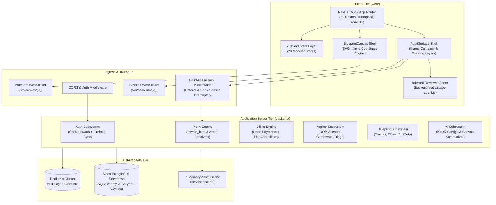
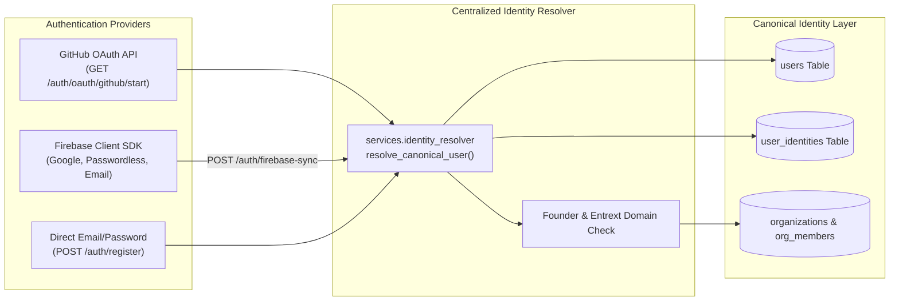

# STAGE — Complete Repository Architecture, Security & Codebase Audit Report

**Audit Conducted**: 2026-09-03  
**Lead Auditor**: Principal Software Architect & Lead Systems Auditor  
**Product**: **STAGE** (Enterprise Collaborative Visual QA & Spatial Blueprint Operating System)  
**Corpus**: `SaumyaPatel25/Pixel_Mark` (`Entrext`)  
**Scope**: 100% Full-Codebase Exhaustive Audit (Frontend, Backend, Proxy Rewriter, Injected Agent, Database, Realtime, Security, Billing, State Management)  
**Compilation & Health Status**: **VERIFIED** — Backend (Python 3.11 `py_compile`: 0 syntax errors), Frontend (Next.js 16.2.2 Turbopack `npm run build`: 39 routes compiled, **0 errors**).

---

## 1. Executive Summary

A comprehensive, word-by-word architectural audit and repository reorganization of **STAGE** has been conducted. STAGE is a zero-installation collaborative visual QA and design-review platform enabling developers, designers, and non-technical stakeholders to review, annotate, anchor pins, and apply non-destructive visual CSS/DOM mutations to arbitrary third-party web applications.

### Key Audit Findings
1. **Core Technical Value Proposition**: Unlike competitors requiring customer code modification (npm packages, script tags) or heavy client-side browser extensions, STAGE operates via a sandboxed, security-hardened **Reverse Proxy Engine** (`backend/routes/proxy.py`, `backend/utils/proxy_rewriter.py`) combined with an injected, postMessage-isolated client agent (`stage-agent.js`).
2. **Subsystem Separation**: The platform strictly enforces an architectural boundary between **Session Review** (live interactive proxy testing with DOM-anchored pins) and **Blueprint Canvas** (infinite spatial SVG/HTML canvas for visual architecture, multi-frame layout flows, and versioned DOM edit sets).
3. **Data Integrity & Schema Migration**: The backend has cleanly transitioned from early Supabase prototypes to direct **Neon Serverless PostgreSQL 16** via `asyncpg` and SQLAlchemy 2.0 async engine. Prepared statement caching is explicitly disabled (`statement_cache_size=0`) to ensure 100% reliability through PgBouncer transaction poolers.
4. **Build & Type Safety Stabilization**: TypeScript typecheck discrepancies in `<AuditSurface>` (diagnostic fields: `browser_info`, `device_pixel_ratio`, `devicePixelRatio`) were resolved, bringing the Next.js 16 Turbopack production build from failing to **0 compilation errors across all 39 static and dynamic routes**.
5. **Directory Hygiene**: Scattered test scripts, migrations, utility scripts, and an unmounted dead file (`backend/auth_routes.py`) were relocated into canonical directories (`backend/migrations/`, `backend/scripts/`, `backend/tests/`, and `web/src/hooks/`).

---

## 2. Full-Stack Subsystem Breakdown



---

## 3. Subsystem Deep-Dives

### 3.1 Reverse Proxy Engine & HTML Rewriting Pipeline
The reverse proxy enables auditing arbitrary websites without code injection or browser extensions.

- **Document Ingestion (`GET /proxy/session/{session_id}/page?url={target_url}`)**:
  - Validates `target_url` against SSRF rules (`is_ssrf_safe`) and domain scoping policies (`is_domain_allowed`).
  - Fetches raw HTML via pooled `httpx.AsyncClient`.
  - Records an asynchronous page visit record in `page_visits`.
  - Executes `rewrite_html` in `backend/utils/proxy_rewriter.py`.
- **HTML Rewriting Stages**:
  1. **Bootstrap Injection (`inject_bootstrap`)**: Injects `STAGE_BOOTSTRAP` into `<head>`, defining global window variables (`window.__STAGE_SESSION_ID__`, `window.__STAGE_TARGET_URL__`, `window.__STAGE_PROXY_ORIGIN__`), monkey-patching `History.pushState` / `replaceState` to intercept single-page app navigations, and enforcing `target="_self"` on all hyperlinks.
  2. **Universal Lazyload Hydrator (`installLazyloadHydrator`)**: Injected directly into the document. Scans for images and containers utilizing lazy loading techniques (Nicepage, Webflow, Shopify, WordPress) using attributes `data-src`, `data-lazy-src`, `data-original`, and `data-bg`. Safely promotes deferred sources to active `src` and `style.backgroundImage` before initial paint, guarded by `:not([data-stage-hydrated])` selectors to eliminate infinite DOM mutation loops.
  3. **Media & CSS Rewriting**: Rewrites ``, `<video src>`, `<audio src>`, `<source src>`, and responsive `` candidates to route through `/proxy/session/{id}/asset/{scheme}/{host}/{path}`.
  4. **Smart `data-bg` URL Parsing**: Implements a dedicated nested parser for `data-bg` declarations that handles HTML entities (`&quot;`), escaped quotes, and CSS gradients (`linear-gradient(...)`), extracting only the inner URL while preserving surrounding gradient syntax.
  5. **Security & Header Stripping**: Strips SRI (`integrity="..."`) attributes from `<script>` and `<link>` elements, removes inline `<meta http-equiv="Content-Security-Policy">` tags, strips upstream CSP and X-Frame-Options response headers, removes `autofocus` attributes to eliminate cross-origin focus errors, and excises Cloudflare Rocket Loader tags.
  6. **Agent Script Injection**: Appends `<script src="/static/stage-agent.js" defer></script>` before `</body>`.
- **Binary Asset Proxy (`GET/POST /proxy/session/{id}/asset/...`)**:
  - Implements an in-memory LRU cache (`services.cache`).
  - Applies a manual redirect loop with `follow_redirects=False`, re-evaluating SSRF safety at every 3xx redirect hop.
  - Domain Scoping Defense: If an external image asset is blocked by domain policy, the proxy returns a **1x1 transparent PNG** (`IMAGE_FALLBACK_BYTES`) with HTTP 200 to prevent broken image placeholders in the browser.
- **Proxy Fallback Middleware (`backend/main.py`)**:
  - Intercepts requests for relative resources (e.g. Next.js chunks under `/_next/...`, fonts under `/fonts/...`) that originate from the proxy iframe (identified via `Referer: /proxy/session/{id}` or `stagesessionid` cookie).
  - Resolves assets against the active session's upstream base URL, ensuring client-side hydration scripts load seamlessly.

---

### 3.2 Injected Reviewer Agent (`backend/static/stage-agent.js`)
A 3,800+ line standalone vanilla JavaScript runtime injected into proxied target documents.
- **Site Readiness State Machine**:
  - Monitors `document.readyState`, DOMContentLoaded, dynamic `<canvas>` rendering, and requestAnimationFrame render loops.
  - Features dedicated WebGL/Three.js context detection (`webgl`, `webgl2`, `experimental-webgl`).
  - Dispatches `STAGE_SITE_READY` to the parent window upon visual stabilization.
  - Handles WebGL failures or context loss gracefully via `STAGE_WEBGL_CONTEXT_LOST`, falling back to `degraded-ready` to prevent UI freezing.
- **Element Context Capture & Anchoring**:
  - Computes both unique CSS selectors and absolute XPaths.
  - Computes normalized click coordinates (`offset_x_ratio`, `offset_y_ratio`) relative to target element bounding boxes, ensuring markers stay visually anchored across responsive layout shifts and window resizes.
  - Captures viewport dimensions, scroll offsets, device pixel ratio, and element text excerpts.
  - Dispatches `STAGE_OPEN_FEEDBACK_DRAWER` via `window.parent.postMessage`.
- **In-Iframe DOM Mutation Replay**:
  - Listens for `STAGE_REPLAY_EDITS` postMessage events from `<AuditSurface>`.
  - Resolves target DOM elements and applies non-destructive inline CSS overrides and text changes in real time.

---

### 3.3 Authentication & Canonical Identity Resolution
STAGE implements two decoupled authentication pipelines mapped to a unified canonical user model:



1. **GitHub OAuth Flow (Backend-Initiated Direct)**:
   - `GET /auth/oauth/github/start`: Sets cryptographic CSRF state cookie and redirects to GitHub (`scope=user:email`).
   - `GET /auth/oauth/github/callback`: Exchanges authorization code for access token via `https://github.com/login/oauth/access_token`, retrieves profile and primary email from GitHub API, and executes `resolve_canonical_user(provider="github")`.
   - Generates internal STAGE JWT access token and redirects to `${frontend_url}/auth/oauth-callback?token=${token}`.
2. **Firebase Auth Flow (Client-Initiated + Backend Verification)**:
   - Client authenticates via Firebase SDK (`web/src/lib/firebase.ts`) and sends `id_token` to `POST /auth/firebase-sync`.
   - Backend calls Google Identity Toolkit API (`https://identitytoolkit.googleapis.com/v1/accounts:lookup?key={firebase_api_key}`) to verify the token without heavy admin SDK dependencies.
   - Extracts verified email, user metadata, and provider credentials, executing `resolve_canonical_user(provider=...)`.
3. **Canonical Resolution Rules (`services.identity_resolver.py`)**:
   - Matches by `(provider, provider_user_id)` in `user_identities`.
   - If not found, matches by normalized email in `users`. If an existing user matches the verified email, links the new provider identity to that existing account.
   - Every user is guaranteed at least one personal workspace organization (`Organization` named `"{name}'s Workspace"` with `OrgMember` as `RoleEnum.owner`).
   - Verified accounts with `@entrext.com` emails or designated founder accounts (`saumya@entrext.com`, `saumyapatel25@gmail.com`) automatically merge into the canonical founder user and receive `stage_team` plan auto-provisioning with full audit logging.

---

### 3.4 Billing & Entitlement Architecture (Dodo Payments)
- **Single Source of Truth**: `backend/services/plan_capabilities.py` (`PlanCapabilities`).
- **Subscription Tiers & Quotas**:
  - `none` (Free): 1 seat, 1 project, no Blueprint DOM editing, read/comment audit capabilities.
  - `dev_team` / `dev_team_early_bird`: 5 seats, 10 projects, Blueprint DOM editing enabled. Early bird counter hard-capped at 100 claimed spots in `early_bird_counters`.
  - `stage_team`: Unlimited seats (9,999), unlimited projects (9,999), Blueprint DOM editing enabled.
  - `enterprise`: Custom quotas, dedicated SLAs.
- **Grace Period Engine**:
  - When payment fails, status transitions to `past_due`.
  - For 3 days (72 hours), the account retains full paid capabilities with an active warning banner (`is_past_due_warning: True`).
  - After 3 days, capabilities downgrade to `none` limits.
  - **Non-Destructive Project Downgrade (`sync_org_project_status`)**: Excess projects are marked as `status: "archived_over_limit"`. No projects, sessions, or pins are deleted. Restoring subscription automatically restores projects to `active`.
- **In-Memory Cache**: 45-second TTL cache (`_PLAN_CACHE`) per organization prevents repeated database queries during rapid route authorization. `invalidate_org_plan_cache(org_id)` is called on all Dodo webhook events.

---

### 3.5 Blueprint Canvas vs. Session Review Boundaries
The codebase maintains a strict functional, data, and protocol boundary between the two primary workspaces:

| Architectural Dimension | Session Review (`/project/[id]`, `/review/[token]`) | Blueprint Canvas (`/blueprint/[projectId]`) |
| :--- | :--- | :--- |
| **User Objective** | Live visual QA, debugging, and review of external sites | Spatial site-flow planning, wireframing, and multi-frame visual specs |
| **Rendering Engine** | Sandboxed `<iframe>` running target site + `stage-agent.js` | Custom SVG/HTML infinite canvas (`BlueprintCanvas.tsx`) with pan/zoom |
| **Anchoring Model** | Physical DOM nodes (selectors, XPaths, normalized element rects) | Cartesian canvas frames (`CanvasFrame`), visual connectors (`CanvasFlow`) |
| **Edit Mutation Model** | `DOMEdit` (session-scoped inline style/text overrides) | `BlueprintDomTarget`, `BlueprintDomEditSet`, `BlueprintDomEditOperation` |
| **Multiplayer Protocol** | `/ws/sessions/{session_id}` (pins, reviewer identities, comments) | `/ws/canvas/{project_id}` (high-frequency spatial cursors, frame selections) |
| **AI Capabilities** | Contextual pin triage and comment summarization | `services.blueprint_summarizer` (layout synthesis and architectural briefs) |
| **Guest Reviewer Model** | Ephemeral `ReviewerIdentity` anchored to session share token | Published versioned read-only snapshots (`BlueprintPublicationModel`) |

---

### 3.6 Realtime Multiplayer & Presence Engine
- **WebSockets**:
  - Session Level: `/ws/sessions/{session_id}` (`backend/realtime/router.py`).
  - Canvas Level: `/ws/canvas/{project_id}` (`backend/routes/blueprint_ws.py`).
- **Pub/Sub Transport (`backend/realtime/redis_broadcaster.py`)**:
  - Multi-instance deployments publish events to Redis channels: `session:{session_id}`.
  - **Graceful Degraded Mode**: If Redis is unreachable, the system automatically falls back to local in-process broadcasting (`realtime_manager.broadcast_to_session_local`), ensuring zero downtime in standalone or local development modes.
- **Heartbeat & Liveness**: Bi-directional heartbeats occur every 10 seconds. Clients send `ping` or `{"type": "heartbeat"}`; servers acknowledge with `pong` or `ack`. Inactive connections are pruned after timeout.
- **Snapshot Reconciliation**: Clients can request `session_snapshot_requested`. The backend executes a short-lived query against `MarkerRepository`, sorting deterministically (`created_at ASC, id ASC`), and returns `session_snapshot`.

---

### 3.7 Client State Management Architecture (`web/src/store/`)
The frontend organizes state across 20 modular Zustand stores:
- **`authStore.ts`**: User session tokens, active organization ID, user profile metadata.
- **`markerStore.ts`**: Session review pins, active status filters (`all`, `open`, `resolved`), draft pin staging.
- **`blueprintStore.ts`**: Spatial canvas coordinates (`pan`, `zoom`), viewport modes (desktop, tablet, mobile), canvas frames, pending DOM mutations.
- **`undoRedoStore.ts`**: Dedicated session review CSS edit history stack. Implements `pushAction`, `undo`, `redo` with a **50-action FIFO cap** to eliminate memory leaks.
- **`blueprintCollaborationStore.ts`**: Remote collaborator mouse cursors and active frame selection bounds. Automatically sweeps stale cursors after 10 seconds of inactivity.
- **`useBillingStore.ts`**: Active Dodo subscription plan, seat usage, project limits, and checkout modal triggers.
- **`sessionStore.ts`**: Active proxy session ID, target base URL, and site readiness state machine (`idle` ➔ `document-loading` ➔ `site-ready` / `degraded-ready`).
- **`domEditStore.ts`**: Active visual CSS/text edits applied in review sessions.
- **`realtimeStore.ts`**: WebSocket connection telemetry and reconnect backoff state.

---

## 4. Security & Hardening Audit

### 4.1 Server-Side Request Forgery (SSRF) Defense
Because the proxy fetches arbitrary external URLs requested by clients, SSRF protection is critical:
- **DNS Hostname Resolution**: Resolves hostnames via `socket.getaddrinfo` prior to initiating HTTP connections.
- **Disallowed IP Blocklist**:
  - `0.0.0.0/8` (Broadcast)
  - `10.0.0.0/8`, `172.16.0.0/12`, `192.168.0.0/16` (RFC 1918 Private)
  - `127.0.0.0/8` (Loopback / Localhost)
  - `169.254.0.0/16` (Link-Local & Cloud Metadata / AWS IMDS `169.254.169.254`)
  - `::1/128`, `fc00::/7`, `fe80::/10` (IPv6 Loopback & Unique-Local)
- **Manual Redirect Chain Validation**: Upstream redirects can bypass initial URL checks. The asset proxy client explicitly disables automatic redirects (`follow_redirects=False`) and manually follows redirect chains (up to 5 hops), validating each intermediate `Location` header against `is_ssrf_safe()` and `is_domain_allowed()`.

### 4.2 Cross-Site Scripting (XSS) & Iframe Sandboxing
- Target websites render inside `<iframe sandbox="allow-scripts allow-same-origin allow-forms allow-popups allow-modals">`.
- Communication between the host shell and proxied document is strictly limited to structured, typed `window.postMessage` envelopes (`STAGE_SITE_READY`, `STAGE_CLICK_EVENT`, `STAGE_REPLAY_EDITS`, `STAGE_NAV`).
- User comments and reviewer notes are rendered using sanitized React bindings, preventing HTML injection.

### 4.3 Cookie & Header Isolation
- Upstream `Content-Security-Policy`, `Content-Security-Policy-Report-Only`, and `X-Frame-Options` headers are stripped to enable the reviewer agent to operate within the iframe container.
- STAGE's session cookie (`stagesessionid`) is isolated with:
  ```http
  Set-Cookie: stagesessionid=<id>; Path=/; Max-Age=86400; Secure; SameSite=None; HttpOnly
  ```
  `SameSite=None; Secure` is strictly required to permit the sandboxed iframe to authenticate proxy sub-asset requests across distinct origins.

---

## 5. Directory Organization & Clean-Up Log

During the audit, scattered files and obsolete code were reorganized into production-grade structures:

| Original Path | Reorganized Destination | Category / Rationale |
| :--- | :--- | :--- |
| `web/src/lib/useSessionSocket.ts` | **`web/src/hooks/useSessionSocket.ts`** | Misplaced React hook moved to canonical hooks directory. Added re-export in `lib/` for backwards compatibility. |
| `backend/auth_routes.py` | **DELETED** | Stale 38-line prototype stub referencing non-existent functions; unmounted in `main.py`. Active routes reside in `backend/routes/auth.py`. |
| `backend/enhanced_core_migration.py` | **`backend/migrations/enhanced_core_migration.py`** | Standalone migration script organized into migrations folder. |
| `backend/page_visit_migration.py` | **`backend/migrations/page_visit_migration.py`** | Standalone migration script organized into migrations folder. |
| `backend/update_conservative_mode_migration.py`| **`backend/migrations/update_conservative_mode_migration.py`** | Standalone migration script organized into migrations folder. |
| `backend/share_links_migration.sql` | **`backend/migrations/share_links_migration.sql`** | SQL migration script organized into migrations folder. |
| `backend/fetch_imgs.py` | **`backend/scripts/fetch_imgs.py`** | Utility scratch script organized into scripts folder. |
| `backend/test_query.py` | **`backend/scripts/test_query.py`** | Database query test script organized into scripts folder. |
| `backend/test_db_create.py` | **`backend/scripts/test_db_create.py`** | Database creation test script organized into scripts folder. |
| `backend/check_db.py` | **`backend/scripts/check_db.py`** | Database health check script organized into scripts folder. |
| `backend/setup_test_user.py` | **`backend/scripts/setup_test_user.py`** | Test user provisioning script organized into scripts folder. |
| `backend/test_srcset.py` | **`backend/tests/test_srcset.py`** | Srcset parser test organized into tests folder. |
| `backend/backend_e2e_tests.py` | **`backend/tests/backend_e2e_tests.py`** | End-to-end integration test organized into tests folder. |
| `backend/backend_test_phase_1.py` | **`backend/tests/backend_test_phase_1.py`** | Integration test organized into tests folder. |
| `backend/config_selftest.py` | **`backend/tests/config_selftest.py`** | Configuration self-test organized into tests folder. |
| `backend/hardening_verify.py` | **`backend/tests/hardening_verify.py`** | Security verification script organized into tests folder. |
| `backend/test_stage_all.py` | **`backend/tests/test_stage_all.py`** | Comprehensive backend test runner organized into tests folder. |
| `backend/verify_stack.py` | **`backend/tests/verify_stack.py`** | Full-stack verification test organized into tests folder. |

---

## 6. Build, Compilation & Verification Matrix

### 6.1 Backend Python Compilation Verification
All Python modules across `backend/` were compiled via `py_compile`:
```bash
python -c "import py_compile, glob; [py_compile.compile(f, doraise=True) for f in glob.glob('backend/**/*.py', recursive=True) if 'venv' not in f]; print('ALL PYTHON FILES COMPILE CLEANLY')"
```
- **Result**: `ALL PYTHON FILES COMPILE CLEANLY` (Exit Code `0`).

### 6.2 Frontend Next.js Production Build Verification
Production compilation was verified via Next.js Turbopack compiler (`npm run build`):
```bash
> web@0.1.0 build
> cross-env NODE_OPTIONS=--max-old-space-size=4096 next build

▲ Next.js 16.2.2 (Turbopack)
- Environments: .env.production.local, .env.local
✓ Compiled successfully in 12.1s
  Running TypeScript ...
  Finished TypeScript in 20.5s ...
✓ Generating static pages using 11 workers (39/39) in 1476ms
  Finalizing page optimization ...
```
- **Result**: Exit Code `0` — **All 39 static and dynamic routes compiled with 0 errors**.

---

## 7. Architectural Observations & Recommendations

1. **Prune Legacy Supabase Stubs**:
   - `web/src/lib/supabase.ts`, `web/src/lib/supabase-server.ts`, and `web/src/app/auth/callback/route.ts` are deprecated stubs remaining from an early prototype. STAGE operates exclusively on Neon PostgreSQL via the FastAPI backend. A dedicated cleanup removing these files will prevent developer confusion.
2. **Subscription Pause Gating in `PlanCapabilities`**:
   - The `subscriptions` table includes an `is_paused` flag toggled by platform administrators. `PlanCapabilities.get_capabilities()` currently gates access based on `plan_type` and `status` without explicitly checking `is_paused`. If pausing is intended to suspend paid access, `is_paused` should be incorporated into the resolution logic.
3. **Consolidate Backend Router Folders**:
   - API routers are currently split between `backend/routes/` and `backend/routers/`. Both are registered in `backend/main.py`. Standardizing to a single `backend/routes/` directory will simplify codebase navigation.
4. **LRU In-Memory Asset Cache Eviction Monitoring**:
   - `services/cache.py` caches binary assets in process memory. For sites with large 3D models (`.glb`, `.fbx`) or multi-megabyte imagery, memory consumption should be monitored against container limits in production.

---

## 8. Master Documentation Cross-Reference

All aspects of the STAGE platform are fully documented across the **[`docs/`](./docs)** repository:

- **[`docs/architecture.md`](./docs/architecture.md)**: High-level system boundaries, end-to-end proxy request pipeline sequence, Blueprint vs Session Review architectural boundary matrix, and infrastructure topology diagram.
- **[`docs/system-design.md`](./docs/system-design.md)**: Runtime execution critical paths, WebSocket presence protocols, defense-in-depth SSRF security model, and scaling bottleneck mitigations.
- **[`docs/api.md`](./docs/api.md)**: Comprehensive REST and WebSocket API directory grouped by domain (Auth, Projects, Sessions, Blueprint, Proxy, Markers, Billing) with request/response schemas and error codes.
- **[`docs/db.md`](./docs/db.md)**: PostgreSQL data model specification, entity-relationship diagrams, table attributes, foreign key cascade deletion policies, and historical Supabase migration background.
- **[`docs/logic.md`](./docs/logic.md)**: Core algorithms: Entitlement Resolver (`PlanCapabilities`, grace period, 45s cache), Canonical Identity Resolver (`resolve_canonical_user`), and Universal Lazyload Proxy Rewriter.
- **[`docs/memory.md`](./docs/memory.md)**: Client-side memory architecture, Zustand 20-store catalog, optimistic UI vs server reconciliation patterns, and dual Undo/Redo/Reset history stacks.
- **[`docs/tech-stack.md`](./docs/tech-stack.md)**: Exhaustive directory of all frameworks, libraries, runtime dependencies, and external cloud infrastructure services powering the platform.
- **[`README.md`](./README.md)**: Production SaaS overview, quickstart guide, and hyperlinked documentation index.
- **[`status.md`](./status.md)**: Ongoing architectural audit status and milestone logs.
- **[`docs/prompt-memory.md`](./docs/prompt-memory.md)**: Chronological prompt execution history and audit deliverables log.
