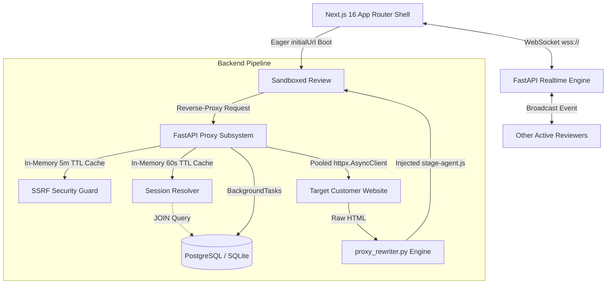

# STAGE — Collaborative Visual QA Operating System

> **The zero-installation reverse-proxy collaboration platform for web applications.**  
> Review, annotate, anchor pins on DOM/Canvas/WebGL elements, edit live styles, and collaborate in real-time without adding scripts or browser extensions to customer repositories.

---

## 🌟 Overview & Key Capabilities

STAGE is a visual QA operating system built for modern product teams, QA engineers, and developers:

1. **Sandboxed Reverse-Proxy Engine**: Proxies and rewrites live target websites on-the-fly (`rewrite_html`), stripping SRI hashes, neutralizing restrictive CSP/X-Frame-Options, and injecting a non-intrusive collaboration agent (`stage-agent.js`).
2. **Sub-200ms Perceived Latency Architecture**: Powered by FastAPI lifespan connection pooling (HTTP/1.1 & HTTP/2 keep-alive), thread-safe in-memory TTL DNS caching for SSRF validation, single-JOIN session base URL resolution, and asynchronous background page visit recording.
3. **DOM & WebGL / 3D Canvas Anchoring**: Pin visual feedback on standard HTML elements or 3D WebGL canvases (Three.js, React Three Fiber, Spline) with automatic context capture and normalized coordinate resolution without GPU frame drops.
4. **Blueprint DOM Mutation Engine**: Live in-browser visual editing workspace allowing developers and designers to tweak styles, toggle CSS classes, and export clean patch sets.
5. **Real-Time Synchronous Collaboration**: Multi-reviewer presence, live cursor tracking, and instant comment updates over WebSockets.
6. **Zero-Trust SSRF & Domain Guardrails**: Strict private CIDR IP validation, domain boundary isolation, and secure, passwordless reviewer link sharing.

---

## 🏗️ Architecture Topology



---

## ⚡ Quickstart

### One-Command Full-Stack Launch
```bash
python run_app.py
```
*Boots the FastAPI backend on `http://localhost:8765` and Next.js frontend on `http://localhost:3000` concurrently with live log streaming.*

---

## 📁 Repository Directory Structure

```text
Entrext/
├── backend/                    # FastAPI async backend service
│   ├── main.py                 # Lifespan startup, middleware & app declaration
│   ├── models/                 # SQLAlchemy async data models
│   ├── routes/                 # REST & proxy endpoints (proxy.py, sessions.py, etc.)
│   ├── proxy/                  # Asset resolvers & runtime policies
│   ├── markers/                # Coordinate anchor calculation & models
│   ├── static/stage-agent.js   # Injected collaboration agent script
│   └── tests/                  # Backend Pytest test suites
├── web/                        # Next.js 16 (React 19, Tailwind CSS, TypeScript)
│   ├── src/app/                # App Router routes ((auth), (dashboard), project/[id])
│   ├── src/components/         # UI components, Mascot Sentinel & AuditSurface
│   ├── src/store/              # Zustand stores (authStore, markerStore, canvasStore)
│   └── src/lib/                # API client, analytics, route classification
├── extension/                  # Chrome extension integration
├── stage-lens/                 # Visual element inspector extension tool
├── scripts/                    # Consolidated diagnostic & validation scripts
├── tests/                      # System E2E & automated integration test suites
└── docs/                       # Complete developer documentation hub
    ├── architecture/           # Performance, proxy engine, backend & frontend architecture
    ├── api/                    # REST API reference & WebSocket protocol specs
    ├── guides/                 # Development guide, deployment, security & incident playbooks
    ├── qa/                     # Testing strategy, smoke checklists & QA matrices
    ├── adr/                    # Architecture Decision Records
    └── archive/                # Historical specs & legacy build logs
```

---

## 🧪 Verification & Testing

### Run Backend Pytest Suite
```bash
cd backend
python -m pytest tests/test_sri_and_regex.py tests/test_webgl_and_mime.py tests/test_markers_v2.py -v
```

### Run Frontend Typecheck
```bash
cd web
npx tsc --noEmit
```

### Run System E2E Verification
```bash
python scripts/verify_suite.py
```

---

## 📚 Documentation Index

Explore the comprehensive guides in [`/docs`](docs/README.md):

* 🚀 [System Architecture](docs/architecture/system-architecture.md) & [System Overview](docs/architecture/system-overview.md)
* ⚡ [Performance & Latency Optimizations](docs/architecture/performance-optimizations.md)
* 🛡️ [Reverse-Proxy & Rewriting Engine](docs/architecture/proxy-engine.md)
* 🔄 [Real-Time WebSocket Sync](docs/architecture/realtime-sync.md) & [Protocol Spec](docs/api/websocket-protocol.md)
* 📊 [Data Model & Entities](docs/architecture/data-model.md)
* 🔌 [REST API Reference](docs/api/rest-api-reference.md)
* 🛠️ [Developer Setup Guide](docs/guides/development-guide.md)
* 🌐 [Deployment & Operations](docs/guides/deployment-and-operations.md)
* 🔒 [Security & SSRF Safeguards](docs/guides/security-and-ssrf.md)
* 📋 [Production Smoke Checklist](docs/qa/production-smoke-checklist.md) & [QA Matrix](docs/qa/qa-matrix.md)

---

## 📄 License
Internal proprietary software developed for high-performance visual quality assurance and real-time collaboration.