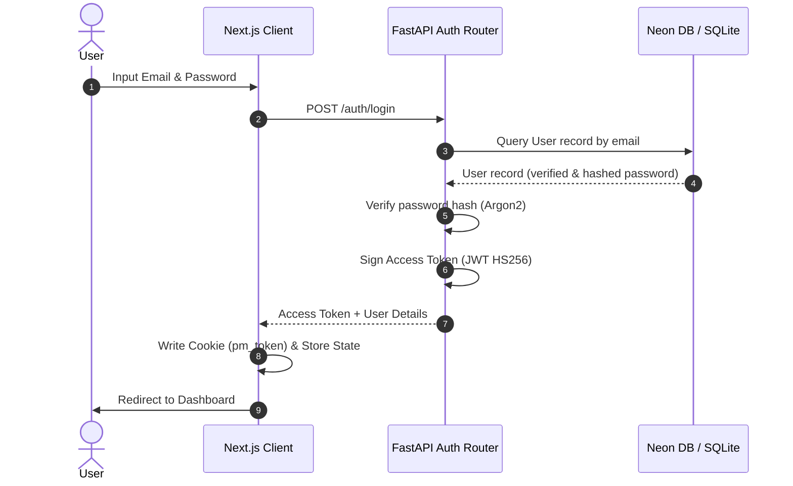
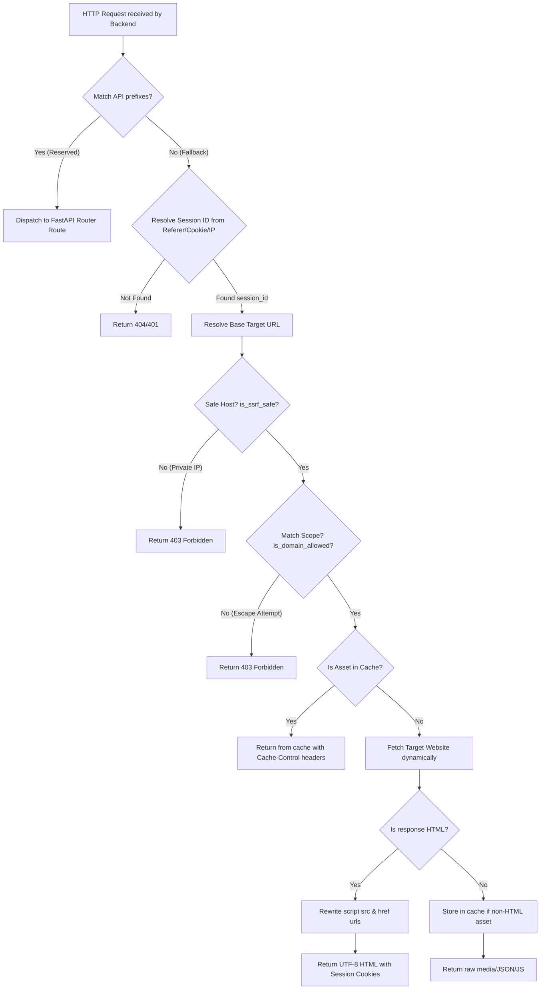
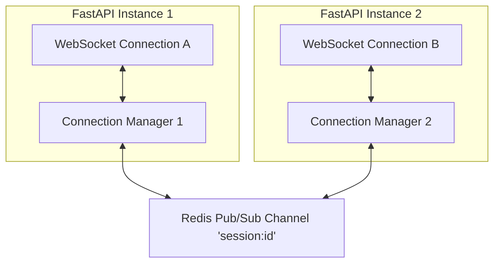

# System Architecture

## 1. Technical Architecture Stack
PixelMark is partitioned into a decoupled frontend client app and a Python backend server.

```mermaid
graph LR
    subgraph Frontend Client (Vercel)
        UI[React 19 / Next.js 16] <--> Zustand[Zustand Stores]
        UI <--> WS_Client[WebSocket Client]
    end
    
    subgraph Backend Server (Railway)
        FastAPI[FastAPI API Gateway] <--> Middleware[Proxy / SSRF Middleware]
        FastAPI <--> RT[Realtime connection manager]
        RT <--> Redis[Redis Pub/Sub]
        FastAPI <--> Cache[InMemory Cache]
        FastAPI <--> Database[PostgreSQL / SQLite]
    end
```

---

## 2. Frontend Architecture
The frontend is constructed using **Next.js 16 (App Router)** and **React 19**. 
- **App Entry Points**: `web/src/app/layout.tsx` (Global styles, providers, and HTML wrappers) and `web/src/app/page.tsx` (Root landing page).
- **Route Layout Groups**:
  - `(auth)`: Login, registration, password resets, and verification screens.
  - `(dashboard)`: Core user workspaces (Dashboard, Projects, Sessions list).
  - `(public)`: Public review reports (`/report/[sessionId]`).
- **Interactive Audiences**:
  - Developers access reviews at `/project/[id]`.
  - External reviewers access sessions via token-redirected paths `/review/[token]`.
- **State Management**: **Zustand** stores (`web/src/store/`) handle auth session state, active projects lists, UI drawers states, and marker actions.
- **Client Realtime Synchronizer**: `web/src/hooks/useRealtimeSync.ts` (manages general cursor syncing) and `web/src/lib/useSessionSocket.ts` (manages session-scoped event subscriptions).

---

## 3. Backend Architecture
The backend is a **FastAPI** web framework running on **Uvicorn**.
- **Server Entry Point**: `backend/main.py` binds endpoints, CORS, database lifespan hooks, and fallbacks.
- **Service/Module Boundaries**:
  - **Auth Service**: `backend/auth.py` and `backend/routes/auth.py` handle Argon2 password hashing, JWT signing, and GitHub OAuth callback handshakes.
  - **Proxy Engine**: Intercepts unregistered requests using a custom HTTP middleware, resolving target domains and rewriting HTML scripts (`backend/utils/proxy_rewriter.py`).
  - **Marker Service**: Coordinates placement logic, coordinate validation invariants (`backend/markers/service.py`), and transactional inserts (`backend/markers/repository.py`).
  - **Realtime Service**: Manages active WebSocket connections (`backend/realtime/connection_manager.py`) and channels messages via Redis (`backend/realtime/redis_broadcaster.py`).

---

## 4. Authentication and Authorization Flow
Reviewers use secure query-string tokens (`share_token`), whereas developers authenticate using HTTP Bearer JWT tokens or custom API Keys (`pm_...`).



- **API Key Flow**: If the header token prefix is `pm_`, the system hashes the key (`services.crypto.hash_token`) and validates it against `api_keys` in the database.
- **Role Scoping**: Access is gated using `require_role(minimum_role)` dependencies, matching Guest, Member, Admin, and Owner to membership schemas.

---

## 5. Request Lifecycle (Proxy & Fallback Engine)
The proxy engine dynamically rewrites assets, Next.js RSC streams, and HTML layouts.



---

## 6. Realtime Synchronization Topology
PixelMark utilizes **Redis Pub/Sub** to link multiple instances horizontally.



1. **Client Action**: Client A creates a marker -> calls `/sessions/{id}/markers`.
2. **Commit & Broadcast**: FastAPI Instance 1 commits the marker to the Database, then publishes the `marker_created` event payload to the Redis channel `session:{id}`.
3. **Instance Propagation**: All connected instances subscribed to `session:{id}` receive the message from Redis.
4. **WebSocket Delivery**: Connection Manager 1 and Connection Manager 2 push the JSON payload to WebSockets A and B.

---

## 7. Caching and Observability
- **Caching**: Implemented as a memory dictionary `InMemoryCache` (`backend/services/cache.py`). Key entries are invalidated on resource mutations (`cache.invalidate(f"user:{id}:*")`).
- **Telemetry**: Global dictionary `SYSTEM_METRICS` logs session recycling counts, fallback occurrences, and idle connection shutdowns. Access metrics at `/metrics` (gated by auth).
- **Error Handling**: Custom handler wrapper `errors.py` intercepts `AppError`, `RequestValidationError`, and raw exceptions to format unified JSON responses.
