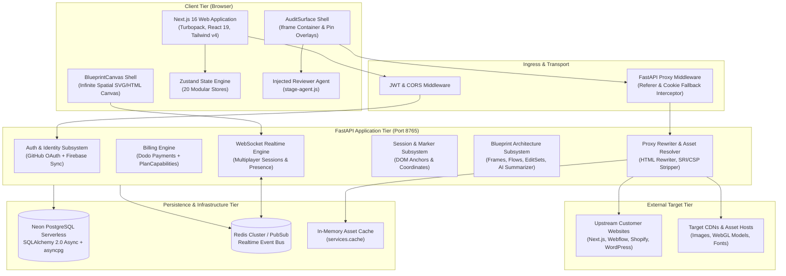
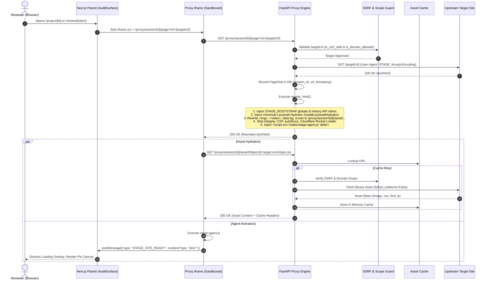
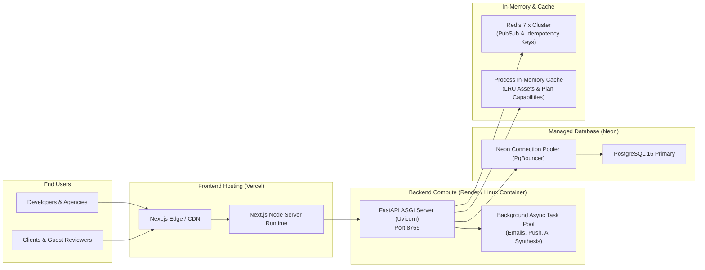

# STAGE Architecture Specification

This document defines the high-level system architecture, service boundaries, data topology, and proxy request pipeline for **STAGE**, the collaborative web review and quality assurance platform.

---

## 1. High-Level System Boundaries

STAGE is organized into five primary architectural subsystems:


```mermaid
flowchart TD
    subgraph Client["Client Tier (Browser)"]
        UI["Next.js 16 Web Application<br/>(Turbopack, React 19, Tailwind v4)"]
        AuditSurface["AuditSurface Shell<br/>(Iframe Container & Pin Overlays)"]
        BlueprintCanvas["BlueprintCanvas Shell<br/>(Infinite Spatial SVG/HTML Canvas)"]
        Zustand["Zustand State Engine<br/>(20 Modular Stores)"]
        Agent["Injected Reviewer Agent<br/>(stage-agent.js)"]
    end

    subgraph Edge["Ingress & Transport"]
        ProxyMid["FastAPI Proxy Middleware<br/>(Referer & Cookie Fallback Interceptor)"]
        AuthMid["JWT & CORS Middleware"]
    end

    subgraph Backend["FastAPI Application Tier (Port 8765)"]
        AuthSvc["Auth & Identity Subsystem<br/>(GitHub OAuth + Firebase Sync)"]
        BillingSvc["Billing Engine<br/>(Dodo Payments + PlanCapabilities)"]
        ProxyEngine["Proxy Rewriter & Asset Resolver<br/>(HTML Rewriter, SRI/CSP Stripper)"]
        ReviewSvc["Session & Marker Subsystem<br/>(DOM Anchors & Coordinates)"]
        BlueprintSvc["Blueprint Architecture Subsystem<br/>(Frames, Flows, EditSets, AI Summarizer)"]
        RealtimeSvc["WebSocket Realtime Engine<br/>(Multiplayer Sessions & Presence)"]
    end

    subgraph Data["Persistence & Infrastructure Tier"]
        DB[(Neon PostgreSQL Serverless<br/>SQLAlchemy 2.0 Async + asyncpg)]
        Redis[(Redis Cluster / PubSub<br/>Realtime Event Bus)]
        MemoryCache["In-Memory Asset Cache<br/>(services.cache)"]
    end

    subgraph Target["External Target Tier"]
        Upstream["Upstream Customer Websites<br/>(Next.js, Webflow, Shopify, WordPress)"]
        ThirdPartyCDN["Target CDNs & Asset Hosts<br/>(Images, WebGL Models, Fonts)"]
    end

    UI --> AuthMid
    AuditSurface --> Agent
    AuditSurface --> ProxyMid
    BlueprintCanvas --> RealtimeSvc
    UI --> Zustand

    ProxyMid --> ProxyEngine
    AuthMid --> AuthSvc
    Backend --> DB
    Backend --> Redis
    ProxyEngine --> MemoryCache

    ProxyEngine --> Upstream
    ProxyEngine --> ThirdPartyCDN
    RealtimeSvc <--> Redis
```

### 1.1 Frontend Tier (`web/`)
- **Technology**: Next.js 16.2.2 (Turbopack, App Router, React 19).
- **Core Surfaces**:
  - **Review Workspace (`/project/[id]`, `/review/[token]`)**: Hosts `<AuditSurface>` which sandboxes target sites in an isolated `iframe`, overlays SVG drawing and marker pins, and communicates with `stage-agent.js` via a bidirectional `window.postMessage` bridge.
  - **Blueprint Workspace (`/blueprint/[projectId]`)**: Hosts `<BlueprintCanvas>` which implements a Figma/Miro-like infinite spatial canvas supporting multi-surface layout cards (`CanvasFrame`), connectors, notes, and architectural summaries.
- **State Layer (`web/src/store/`)**: 20 modular Zustand stores managing local viewport transforms, draft markers, DOM edit preview stacks, active project/environment context, billing quotas, and realtime connection status.

### 1.2 Backend Application Tier (`backend/`)
- **Technology**: FastAPI 0.115+ running on Python 3.11 with `asyncpg` and SQLAlchemy 2.0.
- **Router Registry**: 25+ modular routers handling authentication, project workspaces, review sessions, marker pins, DOM edits, Blueprint frames, billing webhooks, and headless screenshots.
- **Connection Management**: Pooled `httpx.AsyncClient` instances configured with connection limits (`max_keepalive_connections=100`, `max_connections=300`) and separate redirect policies for document versus binary asset fetching.

### 1.3 Reverse Proxy Tier (`backend/routes/proxy.py`, `backend/utils/proxy_rewriter.py`)
- Acts as a security-hardened intermediary between reviewer browsers and arbitrary third-party web properties.
- Rewrites HTML on-the-fly, strips restrictive CSP and SRI hashes, injects client bootstrap state and the reviewer agent, and transparently resolves relative and absolute asset dependencies.

### 1.4 Persistence & Cache Tier
- **Primary Database**: Neon PostgreSQL Serverless accessed via `asyncpg` with statement caching disabled (`statement_cache_size=0`) to ensure full compatibility with Neon's connection pooler.
- **Realtime Pub/Sub**: Redis-backed broadcaster (`realtime.redis_broadcaster`) distributing cursor coordinates, pin creation, and presence heartbeats across multi-instance deployments (with automated fallback to local in-memory dispatch).
- **Asset Cache**: In-memory LRU cache (`services.cache`) storing static CSS, JavaScript, fonts, and images to accelerate proxy turnaround times.

---

## 2. Proxy Engine Request Flow

The Proxy Engine is the core technical differentiator of STAGE. It enables auditing arbitrary third-party websites without browser extensions.


```mermaid
sequenceDiagram
    autonumber
    actor Reviewer as Reviewer (Browser)
    participant Parent as Next.js Parent (AuditSurface)
    participant Iframe as Proxy Iframe (Sandboxed)
    participant Proxy as FastAPI Proxy Engine
    participant Guard as SSRF & Scope Guard
    participant Cache as Asset Cache
    participant Target as Upstream Target Site

    Reviewer->>Parent: Opens /project/[id] or /review/[token]
    Parent->>Iframe: Sets iframe.src = /proxy/session/{id}/page?url={targetUrl}
    Iframe->>Proxy: GET /proxy/session/{id}/page?url={targetUrl}
    
    Proxy->>Guard: Validate targetUrl (is_ssrf_safe & is_domain_allowed)
    Guard-->>Proxy: Target Approved

    Proxy->>Target: GET {targetUrl} (User-Agent: STAGE, Accept-Encoding)
    Target-->>Proxy: 200 OK (text/html)

    Proxy->>Proxy: Record PageVisit in DB (session_id, url, timestamp)
    Proxy->>Proxy: Execute rewrite_html():
    Note over Proxy: 1. Inject STAGE_BOOTSTRAP globals & History API shims<br/>2. Inject Universal Lazyload Hydrator (installLazyloadHydrator)<br/>3. Rewrite <img>, <video>, data-bg, srcset to /proxy/session/{id}/asset/...<br/>4. Strip integrity, CSP, autofocus, Cloudflare Rocket Loader<br/>5. Inject <script src="/static/stage-agent.js" defer>

    Proxy-->>Iframe: 200 OK (Rewritten text/html)
    
    par Asset Hydration
        Iframe->>Proxy: GET /proxy/session/{id}/asset/https/cdn.target.com/style.css
        Proxy->>Cache: Lookup URL
        alt Cache Miss
            Proxy->>Guard: Verify SSRF & Domain Scope
            Proxy->>Target: Fetch Binary Asset (follow_redirects=False)
            Target-->>Proxy: Asset Bytes (image, css, font, js)
            Proxy->>Cache: Store in Memory Cache
        end
        Proxy-->>Iframe: 200 OK (Asset Content + Cache Headers)
    and Agent Activation
        Iframe->>Iframe: Execute stage-agent.js
        Iframe->>Parent: postMessage({ type: "STAGE_SITE_READY", rendererType: "dom" })
        Parent-->>Reviewer: Dismiss Loading Overlay, Render Pin Canvas
    end
```

### 2.1 The HTML Rewriting Pipeline (`rewrite_html`)
When an HTML document traverses the proxy, `backend/utils/proxy_rewriter.py` executes the following transformations in strict sequence:
1. **Bootstrap Injection (`inject_bootstrap`)**:
   - Injected immediately inside `<head>`.
   - Exposes canonical global variables: `window.__STAGE_SESSION_ID__`, `window.__STAGE_TARGET_URL__`, `window.__STAGE_TARGET_ORIGIN__`, and `window.__STAGE_PROXY_ORIGIN__`.
   - Patches the browser `History` API (`pushState`, `replaceState`) so in-app single-page transitions notify the parent shell without breaking proxy isolation.
   - Intercepts `<a>` link clicks and forces `target="_self"` to prevent navigation breakout into new tabs.
   - Installs the **Universal Lazyload Hydrator** (`installLazyloadHydrator`): Watches for `` elements with `data-src`, `data-lazy-src`, and container elements with `data-bg` or `data-srcset` (common across Nicepage, Webflow, Shopify, and WordPress themes) and safely sets `src` and `style.backgroundImage` before rendering, guarded by `:not([data-stage-hydrated])` attributes to eliminate infinite mutation loops.
2. **Media Attribute Rewriting (`proxy_media_attributes`)**:
   - Rewrites `src`, `data`, `data-src`, `data-image`, and `data-image-src` across ``, `<video>`, `<audio>`, `<source>`, `<embed>`, and `<object>` tags to route through `/proxy/session/{id}/asset/{scheme}/{host}/{path}`.
   - Smart-parses `data-bg` attributes: Extracts nested `url(...)` declarations, handles CSS gradients and HTML entities (`&quot;`), and proxies contained asset paths while preserving CSS gradient syntax.
3. **Srcset Rewriting (`proxy_srcset_attributes`)**:
   - Parses multi-resolution `srcset` declarations and routes every responsive candidate through the asset proxy.
4. **Security & Performance Sanitization**:
   - **SRI Stripping**: Removes all `integrity="..."` attributes from `<script>` and `<link>` tags. Upstream SRI hashes invariably fail because proxy URL rewrites modify resource contents.
   - **CSP Stripping**: Eliminates `<meta http-equiv="Content-Security-Policy">` tags and upstream CSP response headers.
   - **Autofocus Stripping**: Removes `autofocus` attributes from form inputs to eliminate cross-origin focus warnings.
   - **Cloudflare Neutralization**: Removes Cloudflare Rocket Loader (`rocket-loader`) and challenge platform scripts that conflict with proxy evaluation.
5. **Agent Script Injection**:
   - Appends `<script src="/static/stage-agent.js" defer></script>` prior to `</body>` to inject the client-side reviewer runtime.

### 2.2 Fallback Middleware (`proxy_fallback_middleware`)
Modern JavaScript frameworks (notably Next.js React Server Component bundles under `/_next/...`) frequently issue relative dynamic imports that bypass rewritten HTML attributes.
- The `proxy_fallback_middleware` in `backend/main.py` intercepts any request whose path does not match reserved API prefixes (e.g. `/auth`, `/projects`, `/sessions`, `/markers`, `/billing`).
- It extracts the target session ID from the `Referer` header or `stagesessionid` cookie, verifies SSRF safety, resolves the asset against the session's base URL, and proxies the request upstream.

---

## 3. Structural Boundary: Blueprint Canvas vs Session Review

STAGE enforces an architectural boundary between **Session Review** and **Blueprint Canvas**. These two subsystems serve distinct phases of the development lifecycle and do not share runtime state or data models:

```
┌──────────────────────────────────────────────────────────────────────────────────────────┐
│                                    STAGE APPLICATION                                     │
├─────────────────────────────────────────────┬────────────────────────────────────────────┤
│           SESSION REVIEW SUBSYSTEM          │          BLUEPRINT CANVAS SUBSYSTEM        │
├─────────────────────────────────────────────┼────────────────────────────────────────────┤
│ • Primary Scope: Session-scoped             │ • Primary Scope: Project-scoped            │
│ • Surface: Sandboxed Proxy Iframe           │ • Surface: Spatial Infinite Canvas (SVG)   │
│ • Core Target: Live External Web Page       │ • Core Target: Multi-Surface Visual Specs  │
│ • State Model: Runtime DOM Markers          │ • State Model: Spatial Frames & Flow Graph │
│ • Persistence: markers, dom_edits           │ • Persistence: canvas_frames, edit_sets    │
│ • WebSocket: /ws/sessions/{session_id}      │ • WebSocket: /ws/projects/{id}/blueprint   │
│ • Guest Access: Password-protected tokens   │ • Guest Access: Published snapshots        │
└─────────────────────────────────────────────┴────────────────────────────────────────────┘
```

### 3.1 Session Review Subsystem (`/project/[id]`, `/review/[token]`)
- **Focus**: Active QA and visual debugging of a live, deployed website.
- **Anchor Mechanism**: Markers are anchored to physical DOM nodes using CSS selectors, XPaths, bounding client rectangles, or WebGL clip-space coordinates captured by `stage-agent.js`.
- **DOM Mutations**: Reviewers can test non-destructive visual CSS/text edits directly on the live session. These are stored in the `dom_edits` table and replayed inside the iframe via `STAGE_REPLAY_EDITS` postMessage events.
- **Actor Context**: Differentiates between authenticated workspace developers (`role: "developer"`) and unauthenticated guest reviewers (`role: "reviewer"` accessing via `ShareLink`).

### 3.2 Blueprint Canvas Subsystem (`/blueprint/[projectId]`)
- **Focus**: Upfront visual architecture, site-flow planning, multi-viewport layout design, and design-system validation.
- **Anchor Mechanism**: Entities are nodes on an infinite Cartesian coordinate space:
  - `CanvasFrame`: Represents an individual page, artboard, or responsive viewport.
  - `CanvasFlow` / Connectors: Represents navigation links and user flow transitions between frames.
  - `CanvasNote` / Sections: Spatial sticky notes and grouping containers.
- **DOM Mutation Sets**: Frame-level DOM edits are structured into versioned packages:
  - `BlueprintDomTarget`: Associates a canvas frame with an external URL or DOM root.
  - `BlueprintDomEditSet`: Logical group of edits (e.g. "Hero Typography Revamp").
  - `BlueprintDomEditOperation`: Individual atomic property mutation (e.g. `font-size: 24px`).
- **AI Synthesis**: Powered by `services.blueprint_summarizer`, which analyzes spatial layout relationships across all canvas frames to generate high-level architectural briefs.

---

## 4. Infrastructure & Service Topology


```mermaid
graph LR
    subgraph Users["End Users"]
        Dev["Developers & Agencies"]
        Client["Clients & Guest Reviewers"]
    end

    subgraph Hosting["Frontend Hosting (Vercel)"]
        NextEdge["Next.js Edge / CDN"]
        NextServer["Next.js Node Server Runtime"]
    end

    subgraph Compute["Backend Compute (Render / Linux Container)"]
        FastAPIServer["FastAPI ASGI Server (Uvicorn)<br/>Port 8765"]
        WorkerPool["Background Async Task Pool<br/>(Emails, Push, AI Synthesis)"]
    end

    subgraph CloudDB["Managed Database (Neon)"]
        NeonProxy["Neon Connection Pooler (PgBouncer)"]
        PostgresPrimary["PostgreSQL 16 Primary"]
    end

    subgraph InMem["In-Memory & Cache"]
        RedisInstance["Redis 7.x Cluster<br/>(PubSub & Idempotency Keys)"]
        LocalCache["Process In-Memory Cache<br/>(LRU Assets & Plan Capabilities)"]
    end

    Dev --> NextEdge
    Client --> NextEdge
    NextEdge --> NextServer
    NextServer --> FastAPIServer

    FastAPIServer --> NeonProxy
    NeonProxy --> PostgresPrimary
    FastAPIServer --> RedisInstance
    FastAPIServer --> LocalCache
    FastAPIServer --> WorkerPool
```

### 4.1 Deployment Topology
- **Web Frontend**: Deployed on Vercel utilizing Next.js Turbopack output, edge rewrites, and standalone server chunks.
- **API Backend**: Deployed as an async container service (Render / Docker) exposing port 8765. Configured with health endpoints at `/health` and `/api/health`.
- **Database Engine**: Neon PostgreSQL Serverless utilizing connection pooling with automatic backoff reconnection on startup (5 retries, exponential delay backoff).
- **Pub/Sub Broker**: Redis 7.x instance managing realtime websocket broadcast channels, with graceful local fallback if connection drops.
