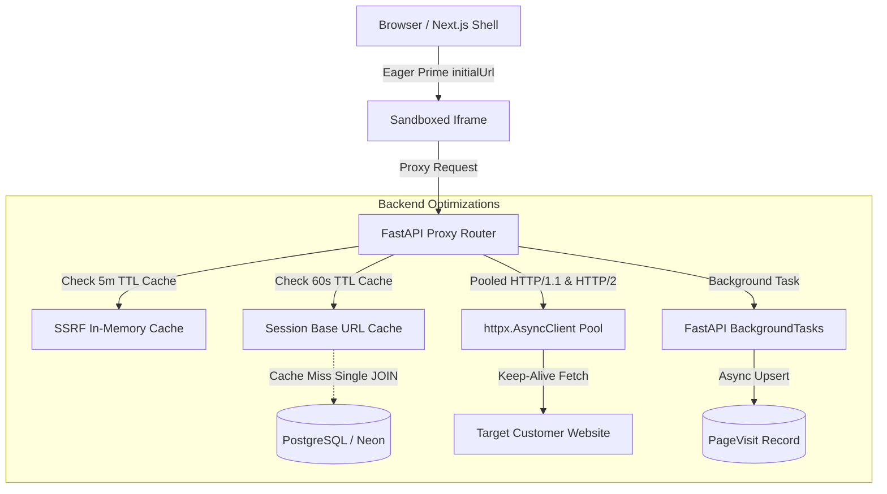

# Performance & Latency Optimization Architecture

This document details the latency reduction and throughput optimization architecture implemented across STAGE's reverse-proxy, database, and client surfaces to achieve sub-200ms perceived latency.

---

## 1. Overview & Latency Mandate

STAGE operates as a live visual QA overlay platform where every target page request, asset stream, and marker placement passes through an integrated reverse-proxy and WebSocket pipeline. To deliver an instant, desktop-grade review experience, the system eliminates connection setup overheads, sequential query waterfalls, synchronous I/O blocking, and unmemoized DNS resolutions.

### Empirical Performance Gains

| Subsystem / Metric | Baseline Metric | Post-Optimization Metric | Empirical Gain |
| :--- | :--- | :--- | :--- |
| **HTTP Upstream Request Client** | 109.98 ms / fetch (unpooled per-request) | 42.52 ms / fetch (pooled keep-alive client) | **61.3% latency reduction** (~67ms saved / asset) |
| **Session Base URL Resolution** | 3.847 ms / call (3 sequential DB queries) | 0.001 ms (cache hit) / 0.860 ms (single JOIN) | **77.6% – 99.9% query latency reduction** |
| **SSRF DNS Hostname Validation** | 0.887 ms / check (blocking `socket.getaddrinfo`) | 0.0025 ms / check (5-min in-memory TTL cache) | **99.7% overhead reduction** |
| **Page Visit DB Recording** | ~15–30 ms synchronous blocking on response path | 0.00 ms (FastAPI `BackgroundTasks` offloaded) | **100% offloaded from critical response path** |
| **Disk Cache Pruning Overhead** | 5–25 ms per asset save (`os.listdir` + `os.stat`) | 0.00 ms (debounced to at most once per 10 mins) | **Eliminates disk I/O contention on burst fetches** |
| **Audit Surface Initial Load Waterfall** | 250–450 ms (waterfall: `getSession` $\to$ `getVisits` $\to$ `get`) | < 1 ms (immediate `initialUrl` prop priming) | **Perceived instant iframe mounting (< 200ms)** |

---

## 2. Architectural Optimizations



### A. Lifespan HTTP Connection Pooling
- **Location**: `backend/main.py`, `backend/routes/proxy.py`
- **Mechanism**: Rather than instantiating an ephemeral `httpx.AsyncClient` per request (which incurs TCP 3-way handshake + TLS negotiation on every asset), FastAPI's lifespan context initializes a global client attached to `app.state.http_client`:
  ```python
  httpx.AsyncClient(
      verify=False,
      timeout=httpx.Timeout(15.0, connect=5.0),
      follow_redirects=True,
      limits=httpx.Limits(
          max_keepalive_connections=100,
          max_connections=300,
          keepalive_expiry=30.0
      )
  )
  ```
- **Lifecycle**: Reused across all proxy handlers (`proxy_initial`, `proxy_page`, `proxy_rsc_request`, `handle_proxy_asset_request`, `stream_binary_asset`, `proxy_form`) and gracefully closed on ASGI shutdown.

### B. SSRF Guard In-Memory TTL DNS Cache
- **Location**: `backend/utils/ssrf_guard.py`
- **Mechanism**: Validating hostnames against SSRF rules requires resolving IP addresses (`socket.getaddrinfo`). To avoid recurring blocking socket delays on repetitive domain requests, resolved hostname safety decisions are cached in a thread-safe `_SSRF_CACHE` dictionary with a 300-second (5-minute) TTL:
  ```python
  _SSRF_CACHE: dict[str, tuple[bool, float]] = {}
  ```
- **Security**: Full security is retained. Private IP ranges (`127.0.0.0/8`, `10.0.0.0/8`, `192.168.0.0/16`, `172.16.0.0/12`, `169.254.0.0/16`), link-local, loopback, and IPv6 equivalents are strictly blocked.

### C. Single JOIN Query & Cached Session Resolution
- **Location**: `backend/routes/proxy.py`
- **Mechanism**: Replaced the 3-query sequential lookup (`Session` $\to$ `Project` $\to$ `Environment`) with a single SQL query joining `Session` and `Project`.
- **In-Memory TTL Cache**: Cached in `_SESSION_BASE_URL_CACHE` for 60 seconds. When a session or environment base URL is mutated or deleted, `invalidate_session_base_url_cache(session_id)` immediately purges the cache entry.

### D. Asynchronous Page Visit Recording
- **Location**: `backend/routes/proxy.py`
- **Mechanism**: Recording page visits for audit analytics is crucial for navigation history, but performing a database write before streaming HTML added 15–30ms of perceived latency to every subpage navigation.
- **Implementation**: Handled via FastAPI's `BackgroundTasks` via `background_record_page_visit()`. HTML rewriting and response streaming return to the browser immediately while the database upsert executes concurrently in the background.

### E. Debounced Disk Cache Pruning
- **Location**: `backend/routes/proxy.py`
- **Mechanism**: Previously, every cached asset write called `prune_disk_cache_if_needed()`, scanning thousands of files on disk with `os.listdir()` and `os.stat()`.
- **Implementation**: Debounced to execute at most once every 10 minutes (`600s`), completely eliminating disk I/O event-loop stalls during asset-heavy page loads.

### F. Frontend Waterfall Elimination & Eager Prop Priming
- **Location**: `web/src/app/project/[id]/page.tsx`, `web/src/components/audit/AuditSurface.tsx`
- **Mechanism**: `<AuditSurface>` previously waited for 3 sequential REST calls (`getSession` $\to$ `getVisits` $\to$ `getProject`) before setting the proxy URL.
- **Implementation**: The parent project review page passes `initialUrl={currentProject?.url}`. `<AuditSurface>` immediately and synchronously primes `currentUrl` and `initialProxyUrl`, allowing the sandboxed iframe to begin loading the target site in parallel with session negotiation.

---

## 3. Best Practices for High-Throughput Proxying

1. **Always reuse `get_proxy_http_client(request)`** instead of instantiating `httpx.AsyncClient()`.
2. **Never execute blocking database commits on the critical response path** — use `background_tasks.add_task(...)`.
3. **Invalidate caches on write** — ensure mutations call `invalidate_session_base_url_cache(session_id)` to prevent stale state.
4. **Preserve streaming for binary 3D assets & RSC components** — use `StreamingResponse` without buffering entire payloads into memory.
