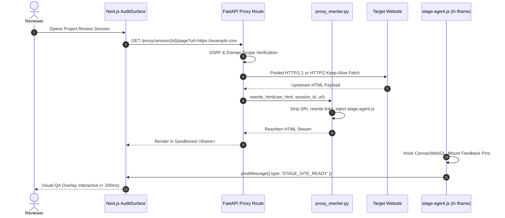

# Reverse-Proxy & HTML Rewriting Engine Architecture

The STAGE Reverse-Proxy Engine is the foundational system component that allows teams to load, interact with, and visually annotate live target web applications in real time without requiring browser extensions or script tags on the customer's source repository.

---

## 1. Core Architecture

---

## 2. Invalidation & Rewriting Components

### A. HTML Rewriter (`backend/proxy_rewriter.py`)
1. **SRI (Subresource Integrity) Stripping**: Strips `integrity="..."` attributes from `<script>` and `<link>` tags because rewritten proxy paths would otherwise cause the browser to fail hash checks.
2. **CSP & Frame-Options Removal**: Clears restrictive upstream security headers (`X-Frame-Options`, `Content-Security-Policy`) in `prepare_proxy_response()` so the page safely mounts within STAGE's audit container.
3. **Asset & Subpage Path Rewriting**:
   - Converts relative `<a href="...">` and form action links to `/proxy/session/{id}/page?url=...`
   - Rewrites CSS `url(...)`, `srcset`, and `` through the asset resolver.
4. **Agent Injection**: Injects `stage-agent.js` into the `<head>` or before `</body>` to orchestrate DOM inspection, marker placement, and WebGL context tracking.

### B. Agent Script (`backend/static/stage-agent.js`)
- **Marker Pin Placement**: Captures exact DOM selectors, normalized coordinates (`xRatio`, `yRatio`), element bounding rects, and XPath coordinates on click.
- **WebGL / 3D Canvas Hooking**:
  - Automatically captures the active rendering context (`WebGLRenderingContext` or `WebGL2RenderingContext`) via `HTMLCanvasElement.prototype.getContext`.
  - Stores the live context instance directly on `canvas.__stage_gl` at creation time.
  - Avoids forcing `preserveDrawingBuffer: true` globally, preventing GPU pipeline stalls and severe frame drops on complex Three.js/R3F scenes.
- **Readiness State Machine**: Emits `STAGE_SITE_READY` via window `postMessage` upon DOM completion and font/canvas initialization, guarded by a 4-second safety fallback.

### C. React Server Component (RSC) & Streaming Route Support
- **Route**: `proxy_rsc_request` in `backend/routes/proxy.py`
- **Behavior**: Detects `text/x-component` and Next.js internal headers (`RSC: 1`, `Next-Router-State-Tree`). Transparently streams chunks to the client via `StreamingResponse` without buffering entire payloads into memory.

---

## 3. Sandboxed Iframe PostMessage Protocol

The Next.js shell and the sandboxed iframe communicate bidirectionally over `window.postMessage`:

| Direction | Event Name | Payload / Description |
| :--- | :--- | :--- |
| **Iframe $\to$ Shell** | `STAGE_SITE_READY` | Signals DOM readiness, viewport size, and renderer type (`dom` vs `webgl`). |
| **Iframe $\to$ Shell** | `STAGE_MARKER_CLICK` | Transmits clicked element coordinates, selector, xpath, and WebGL clip coords. |
| **Iframe $\to$ Shell** | `STAGE_NAVIGATE` | Notifies the shell that the user clicked an in-page link. |
| **Shell $\to$ Iframe** | `STAGE_SET_MODE` | Switches mode between `review`, `blueprint_edit`, and `inspect`. |
| **Shell $\to$ Iframe** | `STAGE_HIGHLIGHT_ELEMENT` | Highlights a DOM element or canvas region corresponding to an active marker. |

---

## 4. Security & Isolation Safeguards

1. **SSRF Guarding**: All upstream URLs pass through `is_ssrf_safe()` with DNS resolution against private CIDR blocks (`10.0.0.0/8`, `172.16.0.0/12`, `192.168.0.0/16`, `127.0.0.0/8`, `169.254.0.0/16`).
2. **Domain Scoping**: Enforces that user navigation cannot escape the authorized project domain root unless explicitly configured.
3. **Session Cookie Isolation**: Each session uses an isolated, encrypted `stagesessionid` cookie mapped to project permissions.
