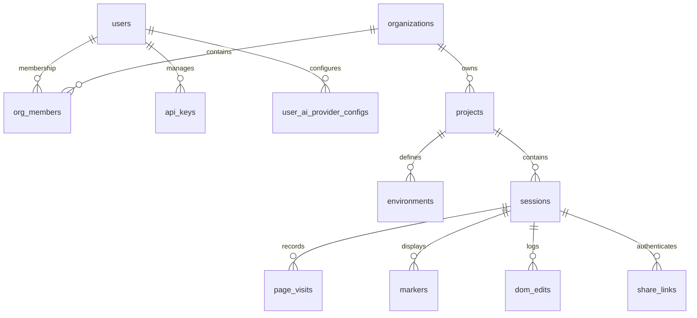

# Data Model and Schema

This document details the database architecture, table schemas, entity relations, and migrations configuration.

---

## 1. Database Infrastructure & Configuration
- **Databases**: 
  - **Local Development**: SQLite (`backend/pixelmark.db` or `backend/test.db`). Enforces foreign key constraints on connection opening (`sqlite_pragma` event listener).
  - **Production**: Neon PostgreSQL (fully serverless connection pooling).
- **Engine Provider**: `backend/database.py` exports `AsyncSession` context managers, using `create_async_engine` to prevent blocking event loops.
- **Migrations Engine**: **Alembic** manages version logs under `backend/alembic/versions/`. Migrations apply during startup lifespans in development.

---

## 2. Entity Relationship Diagram

---

## 3. Entity Details and Tables

### 3.1 Table: `users`
- **Purpose**: Individual credentials and profile registration.
- **Python Model**: [User](file:///c:/Users/saumy/OneDrive/Desktop/Entrext/backend/models/core.py)
- **Schema Details**:
  - `id`: `UUID` (Primary Key, default uuid4).
  - `email`: `String(255)` (Unique, Indexed, Non-Nullable).
  - `password_hash`: `String(255)` (Argon2 hash, Non-Nullable).
  - `name`: `String(255)` (Nullable).
  - `is_active`: `Boolean` (default True).
  - `is_verified`: `Boolean` (default False).
  - `created_at`: `DateTime` (default UTC now).

---

### 3.2 Table: `organizations`
- **Purpose**: Workspace organization container.
- **Python Model**: [Organization](file:///c:/Users/saumy/OneDrive/Desktop/Entrext/backend/models/core.py)
- **Schema Details**:
  - `id`: `UUID` (Primary Key, default uuid4).
  - `name`: `String(255)` (Non-Nullable).
  - `created_at`: `DateTime` (default UTC now).

---

### 3.3 Table: `org_members`
- **Purpose**: Cross-reference table mapping users to organizations with specific access permissions.
- **Python Model**: [OrgMember](file:///c:/Users/saumy/OneDrive/Desktop/Entrext/backend/models/core.py)
- **Schema Details**:
  - `id`: `UUID` (Primary Key, default uuid4).
  - `org_id`: `UUID` (Foreign Key -> `organizations.id`, Cascade Delete, Indexed).
  - `user_id`: `UUID` (Foreign Key -> `users.id`, Cascade Delete, Indexed).
  - `role`: `String(50)` (Values: `owner`, `admin`, `member`, `guest`, Non-Nullable).

---

### 3.4 Table: `projects`
- **Purpose**: Contains targeted web domains audits setups.
- **Python Model**: [Project](file:///c:/Users/saumy/OneDrive/Desktop/Entrext/backend/models/core.py)
- **Schema Details**:
  - `id`: `UUID` (Primary Key, default uuid4).
  - `org_id`: `UUID` (Foreign Key -> `organizations.id`, Cascade Delete, Non-Nullable, Indexed).
  - `name`: `String(255)` (Non-Nullable).
  - `url`: `String(1024)` (Target audited base site, Non-Nullable).
  - `description`: `Text` (Nullable).
  - `created_at`: `DateTime` (default UTC now).

---

### 3.5 Table: `sessions`
- **Purpose**: Captures individual reviews lifecycles.
- **Python Model**: [Session](file:///c:/Users/saumy/OneDrive/Desktop/Entrext/backend/models/core.py)
- **Schema Details**:
  - `id`: `UUID` (Primary Key, default uuid4).
  - `project_id`: `UUID` (Foreign Key -> `projects.id`, Cascade Delete, Non-Nullable, Indexed).
  - `title`: `String(255)` (Non-Nullable).
  - `status`: `String(50)` (Values: `active`, `stale`, `closed`, default `active`).
  - `last_heartbeat_at`: `DateTime` (default UTC now).
  - `created_at`: `DateTime` (default UTC now).

---

### 3.6 Table: `markers`
- **Purpose**: Pin observations details (visual QA tickets).
- **Python Model**: [Marker](file:///c:/Users/saumy/OneDrive/Desktop/Entrext/backend/markers/models.py)
- **Schema Details**:
  - `id`: `String(36)` (Primary Key, supports client-side custom uuids).
  - `session_id`: `UUID` (Foreign Key -> `sessions.id`, Cascade Delete, Non-Nullable, Indexed).
  - `project_id`: `UUID` (Foreign Key -> `projects.id`, Cascade Delete, Non-Nullable, Indexed).
  - `anchor_kind`: `String(50)` (Values: `dom-relative`, `viewport-absolute`, `canvas-relative`, `webgl-clip-space`, `manual`).
  - `page_url`: `String(2048)` (Specific page path where dropped).
  - `page_title`: `String(1024)` (Nullable).
  - `target_selector`: `Text` (Nullable).
  - `target_xpath`: `Text` (Nullable).
  - `dom_text_excerpt`: `Text` (Nullable).
  - `offset_x_ratio`: `Float` (Pin location coordinate percentage, Nullable).
  - `offset_y_ratio`: `Float` (Pin location coordinate percentage, Nullable).
  - `viewport_width`: `Integer` (Viewport scale width, Nullable).
  - `viewport_height`: `Integer` (Viewport scale height, Nullable).
  - `element_rect_json`: `JSON` (Details bounding boxes, tag details).
  - `screenshot_url`: `Text` (Base64 data or S3 storage path, Nullable).
  - `creator_id`: `String(255)` (User or reviewer display identification).
  - `creator_name`: `String(255)`.
  - `creator_role`: `String(50)`.
  - `status`: `String(50)` (Values: `open`, `resolved`, default `open`).
  - `priority`: `String(50)` (Values: `critical`, `high`, `medium`, `low`).
  - `version`: `Integer` (Optimistic locking counter, default 1).
  - `is_deleted`: `Boolean` (Soft delete flag, default False).
  - `created_at`: `DateTime` (default UTC now).

---

### 3.7 Table: `dom_edits`
- **Purpose**: Logs CSS overrides made during inspection sessions.
- **Python Model**: [DOMEdit](file:///c:/Users/saumy/OneDrive/Desktop/Entrext/backend/models/core.py)
- **Schema Details**:
  - `id`: `UUID` (Primary Key, default uuid4).
  - `session_id`: `UUID` (Foreign Key -> `sessions.id`, Cascade Delete, Non-Nullable, Indexed).
  - `selector`: `Text` (Target element DOM path).
  - `xpath`: `Text`.
  - `property`: `String(255)` (CSS styling key).
  - `old_value`: `Text` (Pre-modification style value).
  - `new_value`: `Text` (Modified style value).
  - `page_url`: `String(2048)`.
  - `created_by`: `String(255)` (User identification uuid).
  - `created_at`: `DateTime` (default UTC now).

---

### 3.8 Table: `share_links`
- **Purpose**: Password protected read/write access tokens for clients.
- **Python Model**: [ShareLink](file:///c:/Users/saumy/OneDrive/Desktop/Entrext/backend/models/share_link.py)
- **Schema Details**:
  - `id`: `UUID` (Primary Key, default uuid4).
  - `session_id`: `UUID` (Foreign Key -> `sessions.id`, Cascade Delete, Non-Nullable, Indexed).
  - `token`: `String(255)` (Unique token identifier, Non-Nullable, Indexed).
  - `password_hash`: `String(255)` (Optional password gate).
  - `can_comment`: `Boolean` (default True).
  - `expires_at`: `DateTime` (Expiration timestamps, Nullable).
  - `use_limit`: `Integer` (Max clicks limits, Nullable).
  - `use_count`: `Integer` (Times opened counter, default 0).
  - `is_active`: `Boolean` (default True).
  - `created_at`: `DateTime` (default UTC now).
