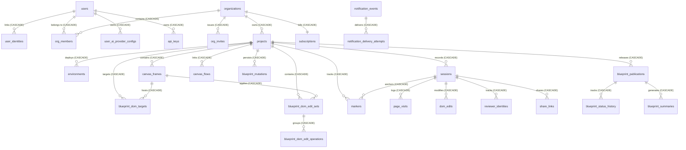

# STAGE Database Schema Specification

This document provides the definitive data model specification for **STAGE**. The production database runs on **Neon PostgreSQL Serverless** (PostgreSQL 16) utilizing `asyncpg` with PgBouncer connection pooling.

> **Historical Architecture Note**: Early platform prototypes utilized Supabase client libraries. The production data layer has been fully migrated to Neon PostgreSQL with direct SQLAlchemy 2.0 async engine and Alembic migrations. All legacy Supabase artifacts in the frontend are deprecated stubs.

---

## 1. Schema Entity Relationship Map

---

## 2. Core Identity & Access Tables

### 2.1 `users`
Represents the canonical human account in STAGE.
- `id` (VARCHAR, PK): UUIDv4 string.
- `email` (VARCHAR, UNIQUE, NOT NULL): Canonical user email address (lowercase).
- `hashed_password` (VARCHAR, NULLABLE): Argon2 / PBKDF2 hash (null for social-only accounts).
- `name` (VARCHAR, NULLABLE): Display name.
- `avatar_url` (VARCHAR, NULLABLE): Remote avatar image URL.
- `is_verified` (BOOLEAN, DEFAULT FALSE): Email confirmation state.
- `is_super_admin` (BOOLEAN, DEFAULT FALSE): Platform administrative privilege.
- `onboarding_state_json` (JSON, NULLABLE): Step-by-step product walkthrough tour state.
- `preferences_json` (JSON, NULLABLE): UI settings (dark mode, layout toggles).
- `verification_token`, `reset_token` (VARCHAR, NULLABLE): Auth flow tokens.
- `created_at`, `updated_at`, `last_login_at` (TIMESTAMPTZ).

### 2.2 `user_identities`
Federated provider links. Enables the same verified email to authenticate via Google, GitHub, or Email link into the identical canonical `User`.
- `id` (VARCHAR, PK): UUIDv4 string.
- `user_id` (VARCHAR, FK `users.id` ON DELETE CASCADE, NOT NULL).
- `provider` (VARCHAR, NOT NULL): Auth provider identifier (`google`, `github`, `email_link`, `firebase`).
- `provider_user_id` (VARCHAR, NOT NULL): Upstream provider subject ID.
- `provider_email` (VARCHAR, NOT NULL): Email address reported by upstream provider.
- `email_verified` (BOOLEAN, DEFAULT TRUE): Provider verification flag.
- **Constraints**: `UNIQUE (provider, provider_user_id)`.

### 2.3 `organizations` & `org_members`
Multi-tenant workspace isolation.
- `organizations`:
  - `id` (VARCHAR, PK): UUIDv4 string.
  - `name` (VARCHAR, NOT NULL): Workspace name.
  - `slug` (VARCHAR, UNIQUE, NOT NULL): URL-safe organization handle.
  - `is_internal` (BOOLEAN, DEFAULT FALSE): Flag auto-granted for `@entrext.com` domain accounts.
- `org_members`:
  - `id` (VARCHAR, PK): UUIDv4 string.
  - `org_id` (VARCHAR, FK `organizations.id` ON DELETE CASCADE, NOT NULL).
  - `user_id` (VARCHAR, FK `users.id` ON DELETE CASCADE, NOT NULL).
  - `role` (ENUM: `owner`, `admin`, `member`, `viewer`): Organization RBAC level.

---

## 3. Project Workspace & Review Tables

### 3.1 `projects`
- `id` (VARCHAR, PK): UUIDv4 string.
- `org_id` (VARCHAR, FK `organizations.id` ON DELETE CASCADE, NOT NULL).
- `name` (VARCHAR, NOT NULL): Project title.
- `url` (VARCHAR, NULLABLE): Primary production / staging URL.
- `status` (VARCHAR, DEFAULT 'active'): `active`, `archived`, `soft_deleted`.
- `allow_reviewer_dom_edit` (BOOLEAN, DEFAULT TRUE): Toggle allowing unauthenticated guest reviewers to propose visual DOM edits.

### 3.2 `sessions`
Represents an individual website review pass through the reverse proxy.
- `id` (VARCHAR, PK): UUIDv4 string.
- `project_id` (VARCHAR, FK `projects.id` ON DELETE CASCADE, NOT NULL).
- `title` (VARCHAR, NULLABLE): Human-readable session title.
- `current_page_url` (VARCHAR, NULLABLE): Last active URL rendered in iframe.
- `pages_visited_count` (INTEGER, DEFAULT 0): Number of pages navigated during session.
- `renderer_type` (VARCHAR, NULLABLE): Detected renderer (`dom`, `canvas2d`, `webgl`, `threejs`).
- `heavy_mode` (BOOLEAN, DEFAULT FALSE): Set when heavy 3D canvas or animation loops are detected.
- `conservative_render_mode` (BOOLEAN, DEFAULT FALSE): Prevents aggressive hydration rewrites on Next.js hydration roots.
- `status` (VARCHAR, DEFAULT 'active'): `active`, `completed`, `archived`.

### 3.3 `page_visits` & `dom_edits`
- `page_visits`:
  - `id` (VARCHAR, PK): UUIDv4 string.
  - `session_id` (VARCHAR, FK `sessions.id` ON DELETE CASCADE, NOT NULL).
  - `page_url` (VARCHAR, NOT NULL, INDEXED): Full URL navigated.
  - `page_title` (VARCHAR, NULLABLE): Document title captured by agent.
  - `visit_count` (INTEGER, DEFAULT 1): Times visited within session.
  - `time_on_page_seconds` (INTEGER, NULLABLE): Dwell time telemetry.
  - `screenshot_url` (VARCHAR, NULLABLE): Thumbnail screenshot artifact URL.
- `dom_edits`:
  - `id` (UUID, PK): Standard UUID.
  - `session_id` (VARCHAR, FK `sessions.id` ON DELETE CASCADE, NOT NULL).
  - `selector` (VARCHAR, NOT NULL): CSS selector target.
  - `xpath` (VARCHAR, NULLABLE): XPath fallback.
  - `property` (VARCHAR, NOT NULL): CSS property modified (e.g. `background-color`, `font-size`, `text-content`).
  - `old_value`, `new_value` (VARCHAR, NULLABLE): Before and after values.
  - `page_url` (VARCHAR, NOT NULL): Page where mutation was executed.

---

## 4. Blueprint Spatial Canvas Tables

### 4.1 `canvas_frames` & `canvas_flows`
- `canvas_frames`:
  - `id` (VARCHAR, PK): UUIDv4 string.
  - `project_id` (VARCHAR, FK `projects.id` ON DELETE CASCADE, NOT NULL).
  - `session_id` (VARCHAR, FK `sessions.id` ON DELETE SET NULL, NULLABLE): Linked proxy session.
  - `title` (VARCHAR, NOT NULL): Artboard title (e.g. "Mobile Checkout", "Landing Hero").
  - `position_x`, `position_y` (FLOAT, DEFAULT 0.0): Spatial Cartesian coordinates.
  - `width`, `height` (FLOAT, DEFAULT 320.0 x 200.0): Artboard dimensions.
  - `color` (VARCHAR, DEFAULT '#1c1b19'): Frame container color token.
  - `snapshot_url` (VARCHAR, NULLABLE): Frame preview image URL.
- `canvas_flows`:
  - `id` (VARCHAR, PK): UUIDv4 string.
  - `project_id` (VARCHAR, FK `projects.id` ON DELETE CASCADE, NOT NULL).
  - `source_frame_id` (VARCHAR, FK `canvas_frames.id` ON DELETE CASCADE, NOT NULL).
  - `target_frame_id` (VARCHAR, FK `canvas_frames.id` ON DELETE CASCADE, NOT NULL).
  - `label` (VARCHAR, NULLABLE): Connector label (e.g. "On Click CTA").

### 4.2 Versioned DOM Operations: `blueprint_dom_targets`, `edit_sets`, `operations`
- `blueprint_dom_targets`: Maps a canvas frame to a physical DOM node in target website.
  - `canvas_frame_id` (FK `canvas_frames.id` ON DELETE CASCADE).
  - `selector_primary`, `selector_fallback`, `xpath` (VARCHAR).
  - `target_signature_json` (JSON): Structural fingerprint of target node.
- `blueprint_dom_edit_sets`: Logical group of design changes.
  - `canvas_frame_id` (FK `canvas_frames.id` ON DELETE CASCADE).
  - `name` (VARCHAR): Group title (e.g. "Summer Sale Banner Overhaul").
  - `version_number` (INTEGER, DEFAULT 1).
  - `status` (VARCHAR): `draft`, `saved`, `archived`.
- `blueprint_dom_edit_operations`: Atomic mutation instruction.
  - `edit_set_id` (VARCHAR, FK `blueprint_dom_edit_sets.id` ON DELETE CASCADE, NOT NULL).
  - `op_type` (VARCHAR): `style`, `content`, `attribute`, `class_toggle`.
  - `property_key` (VARCHAR): Property name (e.g. `padding-top`).
  - `old_value`, `new_value` (TEXT, NULLABLE).
  - `sort_order` (INTEGER, DEFAULT 0).

---

## 5. Markers & Collaboration Tables

### 5.1 `markers` (`backend/markers/models.py`)
Central visual comment and pin anchor repository.
- `id` (VARCHAR, PK): UUIDv4 string.
- `project_id` (VARCHAR, FK `projects.id` ON DELETE CASCADE, NOT NULL).
- `session_id` (VARCHAR, FK `sessions.id` ON DELETE CASCADE, NOT NULL).
- `page_visit_id` (VARCHAR, FK `page_visits.id` ON DELETE SET NULL, NULLABLE).
- `creator_id` (VARCHAR, NULLABLE): User ID or Guest Reviewer ID.
- `creator_role` (VARCHAR): `developer` or `reviewer`.
- `anchor_kind` (VARCHAR, NOT NULL): `dom-relative`, `viewport-absolute`, `canvas-relative`, `webgl-clip-space`.
- `target_selector`, `target_xpath` (VARCHAR, NULLABLE): Precise element anchoring.
- `offset_x_ratio`, `offset_y_ratio` (FLOAT, NULLABLE): Normalized 0.0–1.0 coordinates relative to target bounding box.
- `viewport_x`, `viewport_y`, `page_x`, `page_y` (FLOAT, NULLABLE): Absolute fallback coordinates.
- `title`, `description` (VARCHAR / TEXT): Review issue notes.
- `status` (VARCHAR, DEFAULT 'open'): `open`, `in_progress`, `resolved`.
- `priority` (VARCHAR, DEFAULT 'medium'): `low`, `medium`, `high`, `critical`.
- `is_deleted` (BOOLEAN, DEFAULT FALSE): Soft-deletion flag.

### 5.2 `reviewer_identities`
Ephemeral guest reviewer identities generated on public/shared review sessions.
- `id` (VARCHAR, PK): UUIDv4 string.
- `session_id` (VARCHAR, FK `sessions.id` ON DELETE CASCADE, NOT NULL).
- `display_name` (VARCHAR, NOT NULL): Self-reported reviewer name (e.g. "Sarah (Client QA)").
- `color_token` (VARCHAR, NOT NULL): Assigned hex color token for pin badges.
- `last_seen_at` (TIMESTAMPTZ).

---

## 6. Billing & Subscription Tables

### 6.1 `subscriptions`
- `id` (VARCHAR, PK): UUIDv4 string.
- `org_id` (VARCHAR, FK `organizations.id` ON DELETE CASCADE, NOT NULL, UNIQUE).
- `dodo_customer_id`, `dodo_subscription_id` (VARCHAR, NULLABLE): Dodo Payments remote IDs.
- `plan_type` (VARCHAR, DEFAULT 'none'): `none`, `dev_team`, `dev_team_early_bird`, `stage_team`, `enterprise`.
- `status` (VARCHAR, DEFAULT 'none'): `active`, `past_due`, `canceled`, `trialing`, `incomplete`.
- `seats_allowed` (INTEGER, DEFAULT 1).
- `projects_allowed` (INTEGER, DEFAULT 0).
- `past_due_since` (TIMESTAMPTZ, NULLABLE): Start of 3-day grace period.
- `is_paused` (BOOLEAN, DEFAULT FALSE): Admin subscription pause flag.

### 6.2 `early_bird_counters`
- `id` (VARCHAR, PK, DEFAULT 'dev_team_early_bird').
- `claimed_count` (INTEGER, DEFAULT 0): Claimed early bird discounted seats.
- `max_limit` (INTEGER, DEFAULT 50): Hard cap for early bird pricing.

---

## 7. Foreign Key Cascade Rules Summary

| Parent Table | Child Table | Foreign Key Column | On Delete Action | Technical Justification |
| :--- | :--- | :--- | :--- | :--- |
| `users` | `user_identities` | `user_id` | **CASCADE** | Identities cannot exist without canonical User. |
| `users` | `org_members` | `user_id` | **CASCADE** | Workspace memberships pruned on account deletion. |
| `organizations`| `projects` | `org_id` | **CASCADE** | All workspaces pruned on organization deletion. |
| `organizations`| `subscriptions` | `org_id` | **CASCADE** | Subscription record belongs exclusively to organization. |
| `projects` | `sessions` | `project_id` | **CASCADE** | Review sessions belong exclusively to project. |
| `projects` | `canvas_frames` | `project_id` | **CASCADE** | Canvas artboards belong exclusively to project. |
| `projects` | `markers` | `project_id` | **CASCADE** | Visual pins belong exclusively to project. |
| `sessions` | `markers` | `session_id` | **CASCADE** | Session pins deleted when session is pruned. |
| `sessions` | `dom_edits` | `session_id` | **CASCADE** | Visual edits deleted when session is pruned. |
| `canvas_frames`| `canvas_flows` | `source_frame_id` | **CASCADE** | Connectors deleted if either connected frame is deleted. |
| `blueprint_dom_edit_sets` | `operations` | `edit_set_id` | **CASCADE** | Atomic CSS edits pruned when edit set is deleted. |
| `sessions` | `canvas_frames` | `session_id` | **SET NULL** | Deleting a session does not delete the spatial frame. |
| `users` | `markers` | `author_user_id` | **SET NULL** | Preserves team review markers if creator leaves workspace. |
