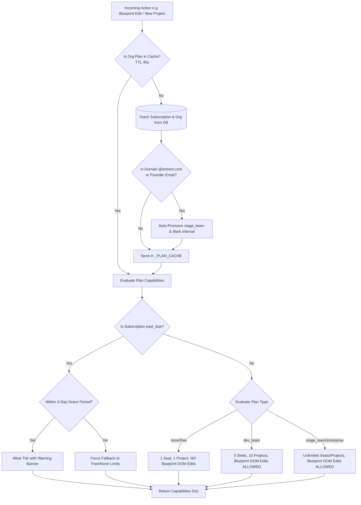
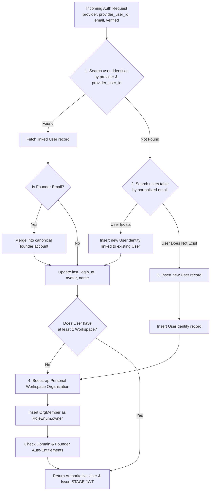

# STAGE Business Logic & Technical Policies

This document specifies the core algorithms, entitlement policies, identity resolution mechanisms, and proxy rewriter mechanics in **STAGE**.

---

## 1. Entitlement & Plan Resolver Logic (`services.plan_capabilities`)

Access to STAGE capabilities (notably the Blueprint DOM Editor, maximum active projects, and workspace seats) is governed strictly through a centralized resolver: `PlanCapabilities.get_capabilities()`.



### 1.1 Entitlement Tier Matrix

| Capability / Quota | `none` (Free) | `dev_team` / `dev_team_early_bird` | `stage_team` (Pro) | `enterprise` |
| :--- | :--- | :--- | :--- | :--- |
| **Max Workspace Seats** | 1 seat | 5 seats | Unlimited (9,999) | Custom / Unlimited |
| **Max Active Projects** | 1 project | 10 projects | Unlimited (9,999) | Custom / Unlimited |
| **Live Proxy Review & Markers** | Full Access | Full Access | Full Access | Full Access |
| **Blueprint DOM Edits** | **Disabled** (`has_blueprint_dom_edit: False`) | **Enabled** (`has_blueprint_dom_edit: True`) | **Enabled** (`has_blueprint_dom_edit: True`) | **Enabled** (`has_blueprint_dom_edit: True`) |
| **AI Architectural Summaries** | Basic | Standard | Priority | Dedicated Model |
| **Early Bird Cap** | N/A | Hard-capped at 100 claimed | N/A | N/A |

### 1.2 Grace Period & Past-Due Enforcement
- When a renewal payment fails, Dodo Payments marks the subscription status as `past_due`.
- `PlanCapabilities` calculates the elapsed time since `subscription.past_due_since`:
  - **Within 3 Days (72 Hours)**: The account retains all paid capabilities (`has_blueprint_dom_edit: True`, full seats/projects) but returns `is_past_due_warning: True` with `grace_period_ends_at` timestamp. A persistent warning banner is rendered in the UI.
  - **After 3 Days**: Capabilities automatically downgrade to `none` tier limits.
  - **Graceful Project Downgrade (`sync_org_project_status`)**: When an organization drops from 10 projects to 1 project, excess projects are transitioned to `status: "archived_over_limit"`. **No user data or audit markers are deleted.** If the organization upgrades again, projects automatically restore to `active`.

### 1.3 In-Memory Cache & Webhook Invalidation
- Capabilities are cached in `_PLAN_CACHE` with a 45-second TTL per organization ID to prevent database thrashing on high-frequency route checks.
- When Dodo webhooks fire (`payment.succeeded`, `subscription.active`, `subscription.cancelled`), the handler calls `invalidate_org_plan_cache(org_id)` to evict stale entries immediately.

### 1.4 Internal Auto-Provisioning
- Verified email addresses ending with `@entrext.com` or matching verified founder emails are automatically provisioned with the `stage_team` tier on signup and login (`ensure_domain_and_founder_entitlement`), writing an audit trail entry in `entitlement_audit_logs`.

---

## 2. Canonical Identity Resolution Logic (`services.identity_resolver`)

STAGE guarantees that a human user authenticating across different auth providers (Google OAuth via Firebase, direct GitHub OAuth, or Email/Password) resolves to the exact same canonical `User` record and workspace data.



### 2.1 Resolution Algorithm Steps (`resolve_canonical_user`)
1. **Email Normalization**: Trims leading/trailing whitespace and converts to lowercase.
2. **Provider Identity Lookup**: Queries `user_identities` table for `(provider, provider_user_id)`. If found, fetches parent `User`.
3. **Email Collision Resolution**: If the identity link does not exist, queries `users` by `email`.
   - If an existing user matches the verified email, links a new `UserIdentity` record to that user. This binds social logins (e.g. Google and GitHub) to existing email/password accounts seamlessly.
4. **User Creation**: If no user exists with that email, instantiates a new `User` record and links the initial `UserIdentity`.
5. **Workspace Guarantee**: Every user account is guaranteed at least one personal workspace organization. If no membership exists, a new `Organization` named `"{name}'s Workspace"` is created, and the user is assigned as `RoleEnum.owner`.

---

## 3. Proxy Rewriting & Asset Pipeline (`utils.proxy_rewriter`, `routes.proxy`)

The Proxy Engine enables arbitrary third-party web pages to be viewed, navigated, and audited inside an iframe shell without browser extensions or target-server code changes.

### 3.1 HTML Rewriting Pipeline (`rewrite_html`)

```
[ Raw Upstream HTML ]
        │
        ▼
[ 1. Inject STAGE_BOOTSTRAP Script ]
  ├── Defines window.__STAGE_SESSION_ID__, target URL & proxy origin globals
  ├── Monkey-patches History API (pushState, replaceState) to prevent iframe navigation breaks
  ├── Intercepts <a> clicks to enforce target="_self"
  └── Injects Universal Lazyload Hydrator (installLazyloadHydrator)
        │
        ▼
[ 2. Universal Lazyload Hydration ]
  ├── Searches: img[data-src], img[data-lazy-src], [data-bg], [data-srcset]
  ├── Copies data-src to src before first render
  └── Guards all hydrated nodes with :not([data-stage-hydrated]) to kill infinite mutation loops
        │
        ▼
[ 3. Media & Style Attribute Rewriting ]
  ├── Rewrites , <video src>, <source src> to /proxy/session/{id}/asset/...
  ├── Smart-parses data-bg: preserves CSS gradients, extracts nested url(...)
  └── Parses responsive srcset entries and proxies all candidate resolutions
        │
        ▼
[ 4. Security & Compatibility Sanitization ]
  ├── SRI Stripping: Drops integrity="..." from <script> and <link>
  ├── CSP Stripping: Drops <meta http-equiv="Content-Security-Policy"> and response headers
  ├── Autofocus Removal: Strips autofocus to eliminate cross-origin focus warnings
  └── Cloudflare Neutralization: Drops rocket-loader and challenge platform scripts
        │
        ▼
[ 5. Reviewer Agent Script Injection ]
  └── Appends <script src="/static/stage-agent.js" defer></script>
        │
        ▼
[ Rewritten Output Streamed to Client Iframe ]
```

### 3.2 `data-bg` URL Parser Logic
Themes built on Nicepage, Webflow, and WordPress frequently store complex background rules in `data-bg` attributes, such as:
```html
data-bg="linear-gradient(0deg, rgba(0,0,0,0.5)), url(&quot;https://cdn.example.com/hero.jpg&quot;)"
```
To avoid corrupting CSS gradients or failing on HTML-escaped quotes (`&quot;`), the rewriter executes a nested quote parser:
- Decodes HTML quote entities (`&quot;`, `&#39;`).
- Extracts inner URLs inside `url(...)` declarations.
- Checks each URL through `to_proxy_asset_url(session_id, extracted_url)`.
- Reconstructs the CSS declaration preserving linear and radial gradient syntax while replacing only the asset URL.

### 3.3 Asset Proxy & Transparent Fallbacks (`routes.proxy.proxy_asset`)
1. **SSRF Guard**: Before fetching any asset, `is_ssrf_safe()` checks the target hostname against private subnets (`10/8`, `172.16/12`, `192.168/16`, `127/8`, `169.254/16`).
2. **Domain Scoping**: If an external asset is requested outside the session's permitted domain list:
   - For images: The proxy catches the block and immediately returns a **1x1 transparent PNG** (`IMAGE_FALLBACK_BYTES`) with `image/png` content-type. This completely avoids broken image icons in the reviewer's browser.
   - For non-images: Returns `403 Forbidden`.
3. **In-Memory Caching (`services.cache`)**:
   - Assets are cached in memory keyed by URL hash.
   - Cache hits return immediate byte streams with `X-STAGE-Cache: HIT` and `Cache-Control: public, max-age=86400`.

### 3.4 CORS & Cookie Isolation Policies
- **CORS Configuration**: The FastAPI backend configures `CORSMiddleware` with `allow_credentials=True` and explicit origin reflection for authenticated dashboard surfaces (`http://localhost:3000`, `https://stage.entrext.com`).
- **Session Cookie Partitioning**:
  - Review sessions issue a session cookie:
    ```http
    Set-Cookie: stagesessionid=<session_id>; Path=/; Max-Age=86400; Secure; SameSite=None; HttpOnly
    ```
  - `SameSite=None` is strictly required to permit the sandboxed iframe to transmit session context when requesting sub-assets and API endpoints across distinct host origins.
  - Dual-read compatibility is maintained for legacy `pixelmark_session_id`.
