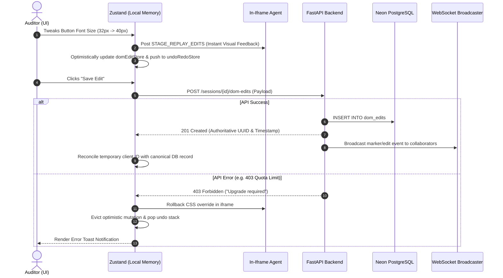

# STAGE State Management & Client Memory Architecture

This document details the frontend state management architecture, memory lifecycle, Zustand store hierarchy, optimistic local UI state vs. canonical database persistence, and the Undo/Redo/Reset history engines in **STAGE**.

---

## 1. Zustand Store Inventory (`web/src/store/`)

STAGE manages client-side state across 20 modular Zustand stores, completely avoiding heavyweight monolithic state trees:

```
web/src/store/
├── authStore.ts                  User session, tokens, active organization & logout
├── markerStore.ts                Review markers, status filters, draft pin state
├── blueprintStore.ts             Spatial infinite canvas, frames, active tool, mutations
├── undoRedoStore.ts              Session review CSS edit history (undo/redo stack)
├── domEditStore.ts               Active visual DOM edit proposals & CSS overrides
├── useBillingStore.ts            Dodo subscription tier, quotas, usage & billing modal
├── sessionStore.ts               Active proxy session ID, site readiness state machine
├── blueprintCollaborationStore.ts Remote peer cursors, selection bounds on Blueprint
├── blueprintActivityStore.ts     Blueprint audit trail events and activity logs
├── blueprintSummaryStore.ts      AI architectural briefs and layout summaries
├── useBlueprintPresenceStore.ts  Frame-level collaborator presence tags
├── realtimeStore.ts              WebSocket connection telemetry and reconnect status
├── screenshotStore.ts            Client-side screen capture overlays (html2canvas)
├── overlayStore.ts               Global modals, feedback drawer, diagnostic sheet
├── projectStore.ts               Active project context and environments list
├── onboardingStore.ts            Interactive step-by-step product walkthrough tour
├── useNotificationStore.ts       In-app notification tray, unread counters
├── themeStore.ts                 Dark / light theme selection
├── uiStore.ts                    Sidebar collapse, viewport layout, command palette
└── aiProviderStore.ts            BYOK AI provider keys (encrypted local persistence)
```

---

## 2. Canonical Database State vs. Optimistic Local State

STAGE employs an **Optimistic Local UI State with Authoritative Server Reconciliation** pattern to ensure latency-free interactions for auditors while preserving database integrity.



### 2.1 State Partitioning Rules

| Subsystem | Optimistic Local UI State | Canonical Server State | Reconciliation Mechanism |
| :--- | :--- | :--- | :--- |
| **Review Markers** | `markerStore.draftMarker`<br/>(unsubmitted pin coordinates, pending comment draft) | `markers` table in Postgres<br/>(authoritative ID, marker number, status) | WebSocket `marker_created` event replaces local draft with server record. |
| **Session DOM Edits** | `domEditStore.activeEdits`<br/>(instant CSS injection via postMessage) | `dom_edits` table in Postgres | On page reload or session switch, backend returns stored edits which re-hydrate the iframe. |
| **Blueprint Canvas** | `blueprintStore.pendingMutations`<br/>(live artboard dragging, uncommitted style tweaks) | `blueprint_dom_edit_sets` and `canvas_frames` | "Save Changes" button flushes pending mutations to backend; errors trigger state rollback. |
| **Billing & Quota** | `useBillingStore.plan`<br/>(cached tier to render UI badges) | Neon `subscriptions` table<br/>(single source of truth in `PlanCapabilities`) | In-memory 45-second cache TTL on backend; webhook invalidates cache on payment. |
| **Multiplayer Cursors** | `blueprintCollaborationStore.remoteCursors`<br/>(60fps mouse interpolation) | Ephemeral Redis Pub/Sub<br/>(never persisted to PostgreSQL) | Disconnect event or 5-second inactivity timeout evicts peer cursor. |

---

## 3. Blueprint History & Undo / Redo Architecture

STAGE features two separate undo/redo systems customized to specific review paradigms:
1. **Session Review Undo/Redo Engine (`web/src/store/undoRedoStore.ts`)**: Designed for granular CSS property tweaks inside the live proxy iframe.
2. **Blueprint Spatial History Engine (`web/src/store/blueprintStore.ts`)**: Designed for macro spatial canvas operations (frame movement, element insertion, DOM target remapping).

### 3.1 Session Review Undo/Redo (`useUndoRedoStore`)
- **State Shape**:
  - `past: UndoRedoAction[]`: FIFO array capped at **50 actions** to prevent browser memory leaks.
  - `future: UndoRedoAction[]`: Cleared whenever a new forward action is pushed.
  - `canUndo: boolean`, `canRedo: boolean`.
- **Action Record (`UndoRedoAction`)**:
  ```typescript
  interface UndoRedoAction {
    id: string
    selector: string
    property: string
    oldValue: string
    newValue: string
    pageUrl: string
    elementTag: string
    timestamp: number
  }
  ```
- **Execution Lifecycle**:
  - Calling `undo()` pops the most recent action from `past`, prepends it to `future`, and dispatches a postMessage down to `stage-agent.js` with `property` set back to `oldValue`.
  - Calling `redo()` pops from `future`, pushes back to `past`, and reapplies `newValue`.

### 3.2 Blueprint Canvas History (`useBlueprintStore`)
- **State Snapshot Model (`BlueprintHistorySnapshot`)**:
  Captures atomic snapshots of the entire canvas workspace:
  ```typescript
  interface BlueprintHistorySnapshot {
    pendingMutations: BlueprintMutation[]
    frames: BlueprintFrameNode[]
    selectedTarget: BlueprintDOMTarget | null
    selectedNodeId: string | null
  }
  ```
- **History Stacks**:
  - `historyPast: BlueprintHistorySnapshot[]`: History stack capped at **30 snapshots**.
  - `historyFuture: BlueprintHistorySnapshot[]`: Forward branch stack.
  - `baselineSnapshot: BlueprintHistorySnapshot | null`: The pristine initial state loaded from the backend when opening the project.
- **Operations**:
  - **`commitHistory()`**: Invoked prior to applying any new mutation or frame position transformation. Takes a deep copy of current mutations and frames, pushes to `historyPast`, and empties `historyFuture`.
  - **`undo()`**: Reverts to `historyPast[last]`, pushing current state to `historyFuture`.
  - **`redo()`**: Advances to `historyFuture[0]`, restoring mutations and frame positions.
  - **`resetToBase()`**: Discards all uncommitted changes by restoring `baselineSnapshot`, clearing pending mutations, and resetting `isDirty: false`.

---

## 4. Memory Safety & Browser Leak Prevention

1. **Iframe Cleanup on Unmount**: When navigating away from `/project/[id]`, `<AuditSurface>` detaches all `window.addEventListener('message')` listeners, nullifies iframe references, and tears down WebSocket heartbeat timers.
2. **WebSocket Reconnect Backoff**: `useSessionSocket` caps reconnect timeouts at 15 seconds with exponential backoff (`Math.min(currentBackoff * 2, 15000)`), preventing CPU/network churn during network degradation.
3. **Cursor Eviction**: `blueprintCollaborationStore` automatically sweeps peer cursors that have not sent a `cursor_move` event within 10 seconds.
