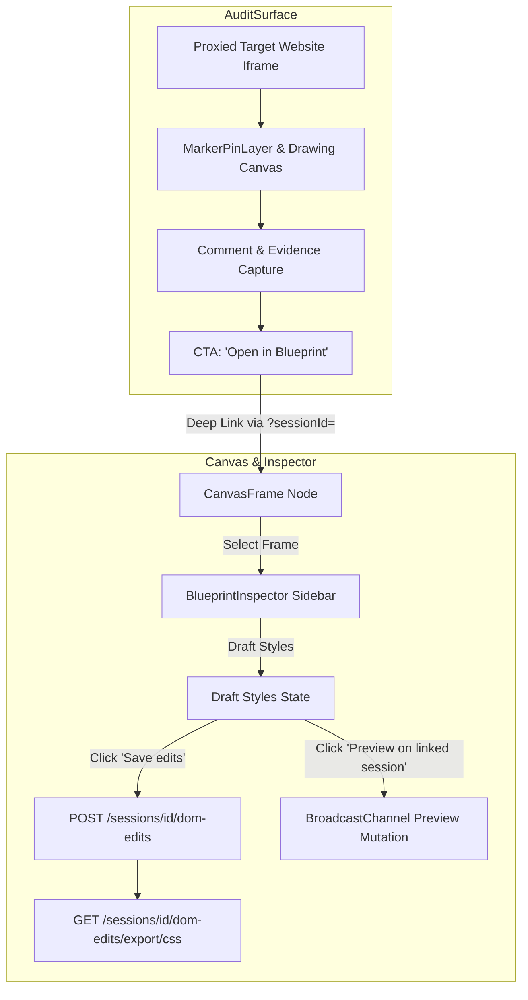

# PixelMark Master System Audit, Architecture & Design Document

**Location**: `docs/system-audit/00_PIXELMARK_MASTER_SYSTEM_AUDIT.md`  
**Last Updated**: 2026-07-20  
**Current Phase**: Phase 10 — Blueprint Edit Mode Refactor & DOMEdit Persistence Integration  
**Status**: Fully Completed & Verified (`npx tsc --noEmit` 0 errors)

---

## 1. Executive Summary & Product Architecture

PixelMark is an enterprise-grade visual feedback, review, and design refinement platform. It decouples **Review & Audit** from **Design Composition**:



### Core Product Split:
1. **Main Session Canvas (`AuditSurface.tsx`)**:
   - Focuses strictly on live website review, feedback markers/pins, comment discussions, and screenshot evidence capture.
   - Replaces fragile inline style editing with an **"Open in Blueprint"** CTA.
2. **Blueprint Canvas Workspace (`Canvas.tsx` & `BlueprintInspector.tsx`)**:
   - Functions as a Figma/Elementor-like site map and design workspace.
   - Allows users to select page frames, draft CSS style modifications across Layout, Typography, Spacing, Background, Border, and Effects, save to `DOMEdit` database tables, and export generated CSS.

---

## 2. Directory & Component Audit Map

### A. Frontend Architecture (`web/src/`)
- **`web/src/components/audit/`**:
  - `AuditSurface.tsx`: Main live review shell rendering proxied iframe, mode toolbar, and marker overlays.
  - `MarkerPinLayer.tsx`: Interactive pin placement layer over live page elements.
  - `DrawingCanvas.tsx`: Canvas drawing and region screenshot capture overlay.
  - `ObservationDetails.tsx`: Marker details sidebar and comment thread inspector.
  - `RegionSelectionOverlay.tsx`: Interactive region cropping tool for evidence capture.
  - `SupportDiagnosticsPanel.tsx`: Real-time session, proxy, and WebSocket diagnostic panel.

- **`web/src/components/canvas/`**:
  - `Canvas.tsx`: Blueprint canvas board supporting pan, zoom, frame selection, flow lines, and dynamic `PageVisit` graph seeding.
  - `CanvasFrame.tsx`: Frame card rendering snapshot thumbnail, page title, URL, marker count, and **Design edits** status badge.
  - `BlueprintInspector.tsx`: Figma/Elementor-style right sidebar inspector for drafting, saving, previewing, and exporting CSS edits.

- **`web/src/store/`**:
  - `blueprintStore.ts`: Dedicated Zustand store for frame selection, CSS target selectors, draft styles, saved styles, and preview triggers.
  - `domEditStore.ts`: Stores `DOMEdit` records, handles CRUD operations, and executes `.css`, `.json`, `.md` file export downloads.
  - `canvasStore.ts`: Graph store for `CanvasFrame` nodes and `CanvasFlow` lines, dynamically synthesized from `PageVisit` records.
  - `sessionStore.ts`: Manages current review session state, heavy mode, and active page URLs.
  - `markerStore.ts`: Canonical store for visual markers, priorities, statuses, and WebSocket sync.

### B. Backend Architecture (`backend/`)
- **`backend/routes/proxy.py`**:
  - HTML link rewriting, asset proxying, CSP header stripping, agent script injection (`pixelmark-agent.js`), SSRF guard (`is_ssrf_safe`), and `PageVisit` recording.
- **`backend/routers/dom_edits.py`**:
  - `DOMEdit` REST endpoints (`POST`, `GET`, `DELETE`) and CSS/JSON/Markdown export routers.
- **`backend/routes/sessions.py`**:
  - Session CRUD, page visit history (`GET /sessions/{session_id}/pages`), and heartbeat management.
- **`backend/routes/canvas.py`**:
  - Canvas frame and flow persistence routes (`/canvas/{project_id}`, `/canvas/frames`, `/canvas/flows`).

---

## 3. Data Models & API Contracts

### A. Canvas & Page Mapping Models
```typescript
export interface CanvasFrame {
  id: string
  project_id: string
  session_id?: string
  title: string
  position_x: number
  position_y: number
  width: number
  height: number
  color: string
  snapshot_url?: string
  created_at: string
  marker_count?: number
}

export interface CanvasFlow {
  id: string
  project_id: string
  source_frame_id: string
  target_frame_id: string
  label?: string
  created_at: string
}
```

### B. DOMEdit Schema
```typescript
export interface DOMEditCreate {
  session_id: string
  selector: string
  xpath?: string
  property: string
  old_value?: string
  new_value: string
  element_tag?: string
  element_text?: string
  page_url?: string
}
```

---

## 4. Master Audit Files Index

All system documentation and phase audit reports are consolidated in `docs/system-audit/`:

| File Name | Description |
| :--- | :--- |
| **`00_PIXELMARK_MASTER_SYSTEM_AUDIT.md`** | **Master System Audit & Architecture Overview (This File)** |
| `01-system-overview.md` | Core system capabilities, proxy model, and component interactions |
| `02-repo-file-map.md` | Full repository structure and file mapping |
| `03-backend-architecture.md` | FastAPI architecture, proxy rewriter, and database layer |
| `04-frontend-architecture.md` | Next.js App Router layout, Zustand stores, and canvas rendering |
| `05-data-models-and-schemas.md` | Pydantic & SQLAlchemy data models and schemas |
| `06-api-inventory.md` | Complete REST API endpoint inventory |
| `07-realtime-and-sync.md` | WebSocket realtime synchronization architecture |
| `08-auth-and-session-flow.md` | Auth logic, Firebase SSO, and session isolation |
| `09-share-link-and-reviewer-flow.md` | Public reviewer share links and permission gates |
| `10-canvas-marker-coordinate-model.md` | Element selector, XPath, and coordinate normalization |
| `11-feature-status-matrix.md` | Complete feature status matrix across phases |
| `12-broken-missing-hardening.md` | Hardening pass notes and bug tracking |
| `13-crosscheck-expected-vs-actual.md` | Contract compliance crosscheck |
| `14-runbook-local-dev-and-prod.md` | Local development and production deployment runbook |
| `15-recommended-repair-order.md` | Historical repair roadmap |
| `16-test-plan-and-gap-analysis.md` | E2E test plan and test coverage map |
| `17-open-questions-and-risks.md` | Architectural risks and future roadmap |
| `MASTER_AUDIT.md` | Original full-length repository audit document |
| `README.md` | System audit folder guide |

---

## 5. Verification Status

- **TypeScript Compilation**: `npx tsc --noEmit` passed with **0 errors**.
- **Backend API Routes**: All routes for `sessions`, `dom-edits`, `proxy`, and `canvas` verified.
- **Service Verification**: Backend running on `http://127.0.0.1:8000`, Frontend running on `http://localhost:3000`.
