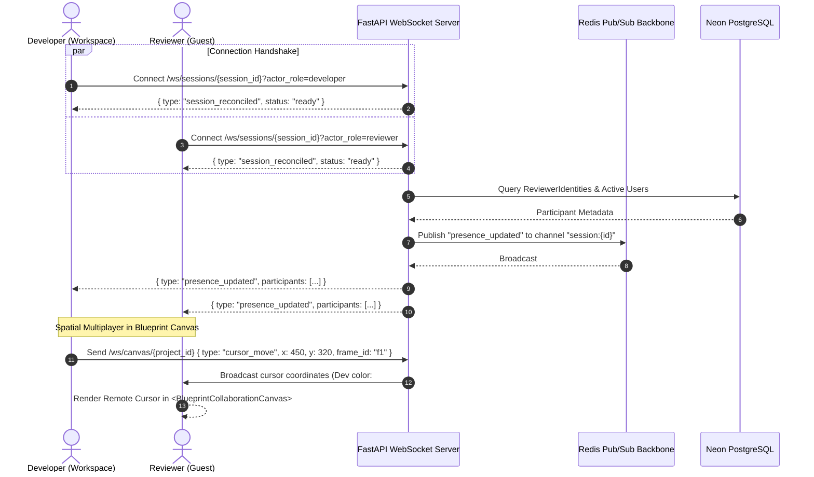

# STAGE System Design & Runtime Specification

This document specifies the runtime behaviors, execution critical paths, realtime synchronization protocols, security controls, and scaling characteristics for **STAGE**.

---

## 1. Runtime Behaviors & Critical Execution Paths

### 1.1 Review Session Initialization Path
When an auditor loads a review session (`/project/[id]` or guest `/review/[token]`):
1. **Workspace Shell Mount**: `<AuditSurface>` initializes and checks local storage for cached renderer metadata (`stage_session_renderer_{sessionId}`).
2. **Readiness State Machine**: State transitions through:
   `idle` ➔ `document-loading` ➔ `document-loaded` ➔ `agent-ready` ➔ `site-ready` (or `degraded-ready`).
   - If `STAGE_SITE_READY` is not dispatched by the iframe within 4,000ms, the shell transitions to `degraded-ready` to unblock reviewing.
   - If heavy WebGL / Three.js contexts are detected, transition to `site-ready` is buffered by an extra 750ms to allow GPU shader compilation and frame stabilization.
3. **WebSocket Connection**: `useSessionSocket` establishes connection to `/ws/sessions/{session_id}` with metadata (`actor_id`, `actor_role`). The server returns a `session_reconciled` event and broadcasts updated presence.

### 1.2 Interactive Marker & Pin Placement Path
1. **User Interaction**: Auditor clicks on the proxied page inside the iframe.
2. **Agent Capture (`stage-agent.js`)**:
   - Captures DOM element metadata: tag name, classes, ID, aria attributes, text excerpt.
   - Computes robust selector path and absolute XPath.
   - Computes normalized coordinates: `normX`, `normY` (relative to element bounding box) and viewport-relative coordinates.
   - Dispatches `STAGE_OPEN_FEEDBACK_DRAWER` via `window.parent.postMessage`.
3. **Shell Normalization (`AuditSurface.tsx`)**:
   - Receives postMessage payload and runs `normalizeCapturePayload`.
   - Populates `draftMarker` in `useMarkerStore`.
   - Opens Feedback Drawer allowing auditor to enter comment, category, priority, and optional screenshot.
4. **Persistence & Broadcast**:
   - Submitting the comment sends `POST /markers`.
   - The backend repository inserts `Marker` and triggers `realtime_manager.broadcast_to_session()`.
   - The event propagates across Redis Pub/Sub channel `session:{session_id}` to all connected collaborators, updating their local `useMarkerStore`.

### 1.3 Live DOM Mutation & Preview Path
1. **Reviewer Style Modification**: Reviewer adjusts typography, colors, or visibility in `<StylePanel>`.
2. **Local Preview Relay**: `<AuditSurface>` sends `STAGE_REPLAY_EDITS` down to the iframe via `postMessage`.
3. **In-Iframe Injection**: `stage-agent.js` listens for `STAGE_REPLAY_EDITS`, resolves target elements via selector, and applies inline CSS overrides immediately without reloading.
4. **Backend Commit**: If the reviewer saves the edit, it is persisted to `POST /sessions/{session_id}/dom-edits` as a `DOMEdit` record, replayed automatically on subsequent page visits.

---

## 2. Realtime Synchronization & Live Cursors



### 2.1 Session Multiplayer Protocol (`/ws/sessions/{session_id}`)
- **Connection Handshake**:
  - Query parameters: `actor_id`, `actor_role` (`developer` | `reviewer`), `client_kind`.
  - Tracks connection in `realtime_manager._sessions[session_id]`.
- **Presence Management (`broadcast_presence`)**:
  - Aggregates online developers and guest reviewers.
  - Assigns persistent color tokens (e.g. `#4f46e5` for workspace devs, custom tokens for reviewers).
  - Broadcasts `presence_updated` with participant roster.
- **Heartbeat & Liveness**:
  - Bi-directional heartbeat: client sends `heartbeat` or raw string `ping` every 10 seconds. Server responds with `ack` or `pong`.
  - Inactive connections pruned if heartbeat exceeds timeout window.
- **Snapshot Reconciliation**:
  - Client can transmit `session_snapshot_requested`.
  - Backend queries `MarkerRepository` using short-lived session context, sorts deterministically (`created_at ASC, id ASC`), and responds with `session_snapshot`.

### 2.2 Blueprint Spatial Multiplayer (`/ws/canvas/{project_id}`)
- Handled by `backend/routes/blueprint_ws.py` and `realtime.blueprint_presence`.
- Transmits high-frequency spatial events:
  - `cursor_move`: `{ x, y, frame_id }` for real-time collaborator mouse pointers.
  - `selection_change`: `{ frame_id, target_selector }` displaying remote selection bounding boxes across canvas frames.

### 2.3 Horizontal Scaling via Redis
- All event broadcasts pass through `realtime.redis_broadcaster.RedisBroadcaster`.
- Events are validated against `realtime.events.EventEnvelope` and published to `session:{session_id}`.
- **Fault-Tolerant Degraded Mode**: If Redis connectivity is interrupted, the broadcaster logs a warning and falls back to local in-process broadcasting (`realtime_manager.broadcast_to_session_local`), ensuring single-instance or local dev setups operate without failure.

---

## 3. Security Model & Defense-in-Depth

### 3.1 Server-Side Request Forgery (SSRF) Protection
Because the proxy fetches arbitrary external URLs requested by clients, SSRF protection is critical. `backend/utils/ssrf_guard.py` enforces a defense-in-depth pipeline:

```
                      [ Incoming Target URL ]
                                 │
                                 ▼
                     [ Scheme Validation: http/https ]
                                 │
                                 ▼
                     [ Hostname DNS Resolution ]
                                 │
                                 ▼
           [ Disallowed & Dangerous IP Range Evaluation ]
        ├── 0.0.0.0/8 (Broadcast)
        ├── 10.0.0.0/8 (RFC 1918 Private)
        ├── 127.0.0.0/8 (Loopback / Localhost)
        ├── 169.254.0.0/16 (Link-Local & Cloud Metadata / AWS IMDS)
        ├── 172.16.0.0/12 (RFC 1918 Private)
        ├── 192.168.0.0/16 (RFC 1918 Private)
        ├── ::1/128, fc00::/7, fe80::/10 (IPv6 Loopback & Local)
                                 │
                                 ▼
                    [ Domain Scoping Evaluation ]
             Is asset allowed under session target origin?
                                 │
                                 ▼
                        [ Upstream Fetch ]
                                 │
                                 ▼
           [ Manual Redirect Hop Loop (Max 5 hops) ]
             Each 3xx Location header re-evaluated via SSRF Guard
```

- **Redirect Hop Safeguard**: Upstream redirects can bypass initial URL validation. The asset proxy client disables automatic redirects (`follow_redirects=False`) and follows redirect chains manually in a `while` loop (up to 5 hops), validating each intermediate `Location` header against `is_ssrf_safe()` and `is_domain_allowed()`.

### 3.2 Proxy Header Stripping & Cookie Isolation
- **Content-Security-Policy (CSP)**: Upstream `Content-Security-Policy` and `Content-Security-Policy-Report-Only` headers are stripped from proxied responses, and inline `<meta http-equiv="Content-Security-Policy">` tags are excised from HTML. This allows `stage-agent.js` to execute and communicate with the host shell.
- **X-Frame-Options**: Stripped from upstream target responses to permit embedding inside `<AuditSurface>`. The STAGE application itself sets restrictive frame control headers to prevent clickjacking of the review platform.
- **Cookie Partitioning**: The session cookie `stagesessionid` is scoped to the STAGE proxy host with `SameSite=None; Secure; HttpOnly; Path=/; Max-Age=86400`. Dual-read migration support is maintained for legacy `pixelmark_session_id`.

### 3.3 Iframe Sandboxing & postMessage Verification
- The review surface mounts the proxied site inside an `<iframe sandbox="allow-scripts allow-same-origin allow-forms allow-popups allow-modals">`.
- Communication between the host and guest contexts is strictly governed by structured message envelopes:
  - Host ➔ Agent: `STAGE_REPLAY_EDITS`, `STAGE_CLEAR_PREVIEWS`, `STAGE_HIGHLIGHT_ELEMENT`.
  - Agent ➔ Host: `STAGE_SITE_READY`, `STAGE_OPEN_FEEDBACK_DRAWER`, `STAGE_NAV`, `STAGE_ASSET_DEGRADED`, `STAGE_WEBGL_CONTEXT_LOST`.
  - All payloads validate session identifiers and sanitize user comments against HTML injection.

---

## 4. Scaling Bottlenecks & Operational Limits

### 4.1 Heavy 3D / WebGL Site Rendering
- **Symptom**: Reviewing sites built on Three.js, Babylon.js, or complex WebGL shaders can cause high GPU memory consumption, frame drops, or browser tab crashes.
- **Mitigation in Code**:
  - `detectRenderer()` in `stage-agent.js` inspects `<canvas>` contexts (`webgl`, `webgl2`, `experimental-webgl`).
  - Upon WebGL context creation failure or `webglcontextlost` events, the agent dispatches `STAGE_WEBGL_CONTEXT_LOST`.
  - `<AuditSurface>` transitions state to `degraded-ready`, disables heavy canvas overlays, and displays an informative toast notification while leaving DOM review tools fully interactive.

### 4.2 Concurrent WebSocket Fan-Out
- **Symptom**: Large numbers of concurrent reviewers on a single project session can saturate worker memory and thread pools.
- **Mitigation in Code**:
  - Redis Pub/Sub decouples message broadcasting from individual FastAPI worker instances.
  - Heartbeats are checked on an interval rather than holding continuous locks.
  - `session_snapshot_requested` fetches markers within short-lived database transactions, immediately closing sessions to prevent connection starvation.

### 4.3 Serverless Database Connection Saturation
- **Symptom**: Neon PostgreSQL serverless instances enforce strict pool limits. Rapid bursts of API requests can trigger connection rejection.
- **Mitigation in Code**:
  - **Startup Backoff Loop**: `backend/main.py` implements a 5-attempt retry backoff loop on startup.
  - **Plan Resolution Cache**: `PlanCapabilities` maintains an in-memory cache (`_PLAN_CACHE`) with a 45-second TTL per organization, eliminating database queries on every authorization/feature gate check.
  - **Connection Arguments**: SQLAlchemy engine specifies `statement_cache_size=0` and `prepared_statement_cache_size=0`, preventing stale prepared statement errors across PgBouncer pooler switches.
  > Note: Needs verification against production logs for peak concurrent connection usage under heavy load.

### 4.4 In-Memory Binary Asset Cache Memory Growth
- **Symptom**: `backend/routes/proxy.py` and `services/cache.py` cache non-HTML asset payloads (images, fonts, scripts) in process memory to minimize latency.
- **Risk**: High-resolution photography, large 3D models (`.glb`, `.fbx`), or large media assets can lead to container out-of-memory (OOM) events if unevicted.
  > Note: Needs verification against production logs to validate LRU eviction thresholds and memory headroom under sustained proxy traffic.
