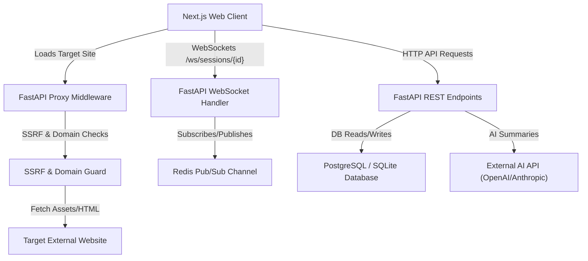

# System Overview

## 1. What the Product Does
STAGE is a visual QA and collaboration suite designed to simplify website audits. Instead of taking manual screenshots and typing descriptive reports, developers can load target sites inside STAGE. 

STAGE launches a sandboxed proxy runner that acts as a secure intermediary, stripping blocking security headers (like frame options) and rewriting URLs. Reviewers and clients can then view the target site directly inside an overlay, point and click anywhere (DOM nodes, HTML5 Canvas, WebGL scenes) to drop pins, write feedback, annotate screenshots, record DOM style modifications, and sync with developers in real time.

---

## 2. User Roles and Capabilities

| Role | Target Audience | Primary Capabilities |
| --- | --- | --- |
| **Developer / Owner** | Internal tech team | - Full access to all projects, canvas layouts, and review sessions. - Add, edit, resolve, and delete any feedback pins (markers). - Configure custom AI keys/providers (OpenAI, Anthropic, etc.). - View and export full system diagnostics, CSV logs, and AI reports. |
| **Reviewer / Guest** | Invited collaborators / Clients | - Access specific sessions via secure, password-protected tokens. - Drop comments, edit styles, and create reviewer identities. - Modify/delete only their *own* markers. Cannot delete developer markers. |
| **Anonymous User** | External public | - View the dashboard waitlist or land on public marketing pages. |

---

## 3. High-Level Architectural Style
STAGE follows a **hybrid Client-Server and Event-Driven Realtime** architectural style:
1. **Proxy-based Sandboxing**: Fallback middleware intercepts HTTP traffic and rewrites it dynamically, allowing third-party sites to run cleanly inside STAGE's iframe overlays without header violations.
2. **REST API**: Standard CRUD operations (auth, project creation, keys management) are handled via FastAPI routes.
3. **WebSockets + Redis Pub/Sub**: Real-time cursor coordinates and marker mutations are broadcasted across server instances using a Redis Pub/Sub backbone, scaling horizontally. If Redis is unavailable, it gracefully falls back to local single-instance WebSocket broadcasting.

---

## 4. System Boundaries and Safeguards
- **SSRF Guard**: Resolves target hostnames and enforces strict restrictions on private IP addresses, loopback addresses (`127.0.0.1`, `::1`), and link-local ranges, preventing malicious internal routing.
- **Domain Lock**: Enforces scoping boundaries. If a user clicks a link that leaves the project's base URL domain/subdomain, the proxy block navigates back or refuses forwarding. Safe external assets (Cloudflare, unpkg, Tailwind CDN) are whitelisted for assets loading only.
- **X-Frame-Options & CSP Stripping**: The proxy dynamically intercepts and deletes frame-prevention headers from targeted websites so they can render within the overlay iframe.

---

## 5. System Diagram

---

## 6. Confidence Matrix

### VERIFIED
- SQLite / Neon database models (`backend/models/core.py`, `backend/models/share_link.py`).
- API routes, authentication gates, and token verifications (`backend/routes/auth.py`, `backend/dependencies.py`).
- SSRF and domain restrictions (`backend/utils/ssrf_guard.py`).
- Iframe HTML rewriting, Next.js streaming, and asset redirection (`backend/routes/proxy.py`, `backend/utils/proxy_rewriter.py`).
- Zustand stores and Next.js client-side layouts (`web/src/store/`, `web/src/app/(dashboard)/DashboardLayoutClient.tsx`).
- Real-time connection management and Redis Pub/Sub loops (`backend/realtime/connection_manager.py`, `backend/realtime/redis_broadcaster.py`).

### INFERRED
- Local E2E testing using local SQLite databases (`backend/test.db` / `backend/stage.db`).
- Build pipeline assumptions via `nixpacks.toml` and `railway.toml`.
