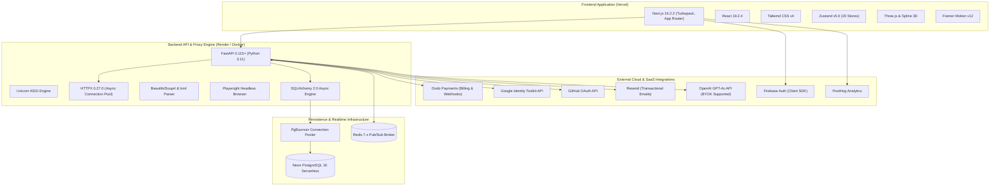

# STAGE Technology Stack & Infrastructure Directory

This document provides the exhaustive specification of all programming languages, frameworks, libraries, database engines, and third-party SaaS infrastructure powering **STAGE**.

---

## 1. System-Wide Architectural Overview

---

## 2. Frontend Technology Stack (`web/`)

| Technology | Version | Architectural Role in STAGE |
| :--- | :--- | :--- |
| **Next.js** | `16.2.2` | Core web framework utilizing App Router and Turbopack compiler. Prerenders 39 static and dynamic routes. Handles edge middleware routing. |
| **React** | `19.2.4` | Component runtime. Leverages React 19 hooks, concurrent transitions, and Suspense wrappers around dynamic workspace views. |
| **Tailwind CSS** | `^4.0.0` | Utility-first styling framework with `@tailwindcss/postcss`. Compiles dark-mode aesthetic with custom design tokens. |
| **Zustand** | `^5.0.13` | Lightweight client state engine. Powers 20 domain-specific stores (e.g., `blueprintStore`, `markerStore`, `authStore`) without boilerplate. |
| **Lucide React** | `^1.7.0` | Comprehensive icon library for toolbars, pin category badges, and UI status indicators. |
| **Framer Motion** | `^12.38.0` | Animation engine powering smooth drawer slide-ins, pin placement pulses, and toast alerts. |
| **HTML2Canvas** | `^1.4.1` | Client-side visual capture engine used as fallback for local audit screenshot generation. |
| **Three.js / Spline** | `^0.185.1` | WebGL canvas renderers for interactive 3D hero assets on public product landing pages. |
| **Firebase Client SDK**| `^12.16.0` | Handles Google OAuth, passwordless email links, and client authentication credential management. |
| **PostHog JS** | `^1.391.6` | Product telemetry, feature flag evaluations, and session interaction analytics. |
| **TypeScript** | `^5.0.0` | Strict static type checking ensuring full contract safety across client and server envelopes. |
| **Vitest** | `^4.1.9` | High-speed unit test runner with JSDOM environment for frontend components and store logic. |

---

## 3. Backend Technology Stack (`backend/`)

| Technology | Version | Architectural Role in STAGE |
| :--- | :--- | :--- |
| **Python** | `3.11+` | Core language runtime providing native `asyncio` concurrency for high-throughput HTTP proxying and WebSockets. |
| **FastAPI** | `0.115+` | High-performance ASGI web framework. Exposes 25+ modular API routers with automatic OpenAPI schema generation. |
| **Uvicorn** | `0.30.0` | Lightning-fast ASGI web server implementation based on `uvloop` and `httptools`. |
| **SQLAlchemy** | `2.0.30` | Modern async ORM. Executes asynchronous database operations via `asyncpg` with zero statement cache errors. |
| **asyncpg** | `0.29.0` | High-performance asynchronous PostgreSQL database driver engineered specifically for Python and `asyncio`. |
| **HTTPX** | `0.27.0` | Async HTTP client with connection pooling (`httpx.AsyncClient`). Drives the reverse proxy document and binary asset fetching engine. |
| **BeautifulSoup4 / lxml** | `4.12.3 / 5.2.2`| High-speed HTML parsing and DOM tree manipulation library. Executes `rewrite_html`, SRI stripping, and lazyload hydration. |
| **Playwright** | `1.60.0` | Headless Chromium automation engine for rendering high-fidelity audit screenshots on `/screenshot` routes. |
| **Redis Python** | `>=5.0.0` | Async Redis client managing Pub/Sub message channels for multiplayer WebSocket broadcasting and idempotency locks. |
| **Python-JOSE / Argon2** | `3.3.0 / 23.1.0`| Cryptographic libraries for JWT access token encoding/verification and Argon2 password hashing. |
| **Pydantic** | `2.7.0` | Strict data validation and serialization library defining request and response models across all endpoints. |
| **aiosqlite** | `0.20.0` | Async SQLite driver providing lightweight, isolated database fixtures during local unit tests. |

---

## 4. Cloud & Infrastructure Services

| Service | Provider | Specific Function in STAGE Ecosystem |
| :--- | :--- | :--- |
| **Primary Database** | **Neon** | Serverless PostgreSQL 16 database. Scales compute independently from storage, with PgBouncer connection pooling. |
| **Realtime Pub/Sub** | **Redis** | Centralized broker enabling horizontal fan-out of live cursor moves, pin creation, and presence updates across workers. |
| **Payment & Billing** | **Dodo Payments** | Hosted checkout, recurring subscriptions, early bird counter limits, and automated webhooks for plan lifecycle. |
| **Identity Verification** | **Google Identity Toolkit** | Backend token verification API (`accounts:lookup`) validating Firebase client JWTs without heavy SDK overhead. |
| **Developer OAuth** | **GitHub API** | Direct OAuth2 authorization server allowing software engineering teams to authenticate with their GitHub credentials. |
| **Transactional Email** | **Resend** | Reliable email delivery service sending workspace invites, verification links, and password reset instructions. |
| **AI Synthesis** | **OpenAI** | Powers `services.blueprint_summarizer` (GPT-4o) and interactive design suggestions. Supports user-supplied BYOK keys. |
| **Web Hosting** | **Vercel** | Global edge network hosting the Next.js frontend with automated preview branch deployments. |
| **API Compute** | **Render / Docker** | Containerized Linux compute running the FastAPI ASGI service with automatic health checking and horizontal scaling. |
