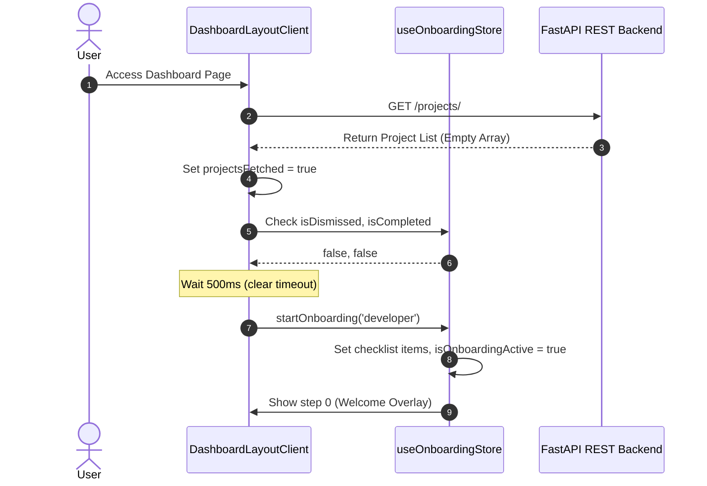
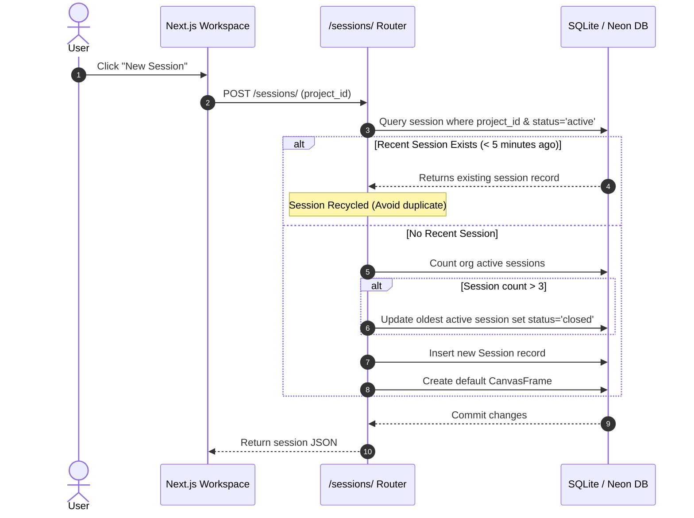
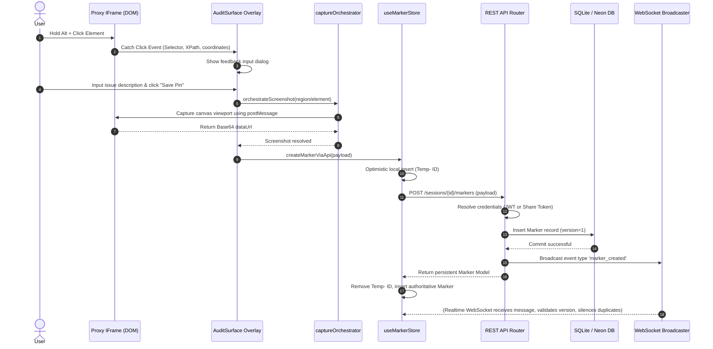
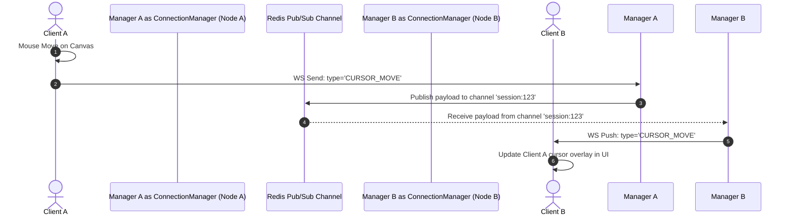

# System Workflows

This document diagrams the execution paths for core STAGE features, tracing interactions from user click down to database commits.

---

## 1. Onboarding and Gated Project Initialization Workflow
Registers new accounts and triggers the product tour.

---

## 2. Session Launch and recycling Workflow
Determines if an active session can be reused to reduce DB allocations.

---

## 3. Visual Pin-Dropping & Regional Capture Workflow
Highlights elements inside the sandboxed iframe and captures annotations.

---

## 4. Real-time Cursor Coordinates Sync Loop
Sends client mouse moves across clustered servers.

