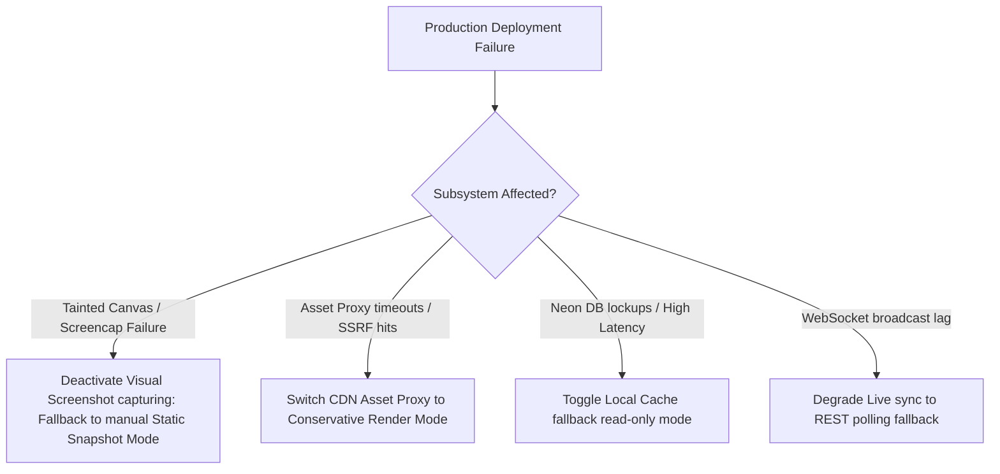

# PixelMark Production-Only Smoke Test Checklist & Release Gate

This document outlines the end-to-end production smoke test checklist, the subsystem failure rollback protocols, and the official release gate criteria for PixelMark. All operations target live production endpoints only (no local hosts, mocks, or sandbox databases).

---

## 1. Production Smoke Test Checklist

### 🏁 Phase A: Initial Configuration & Environment Setup
- `[ ]` **Verify Live URLs**:
  - Production Frontend URL is active and secured via HTTPS.
  - Production Backend API endpoint resolves (e.g. `/docs` or `/health` is reachable).
- `[ ]` **Verify Database Isolation**:
  - The Neon Database connection is fully migrated to the latest schema version (`conservative_render_mode` and `renderer_type` columns must be present).
  - Test session creates new mock entities using isolated test schemas to ensure no production user data leakage.

### 🔐 Phase B: Core Authentication & User Onboarding
- `[ ]` **Verify User Registration**:
  - Navigate to `https://[production-frontend]/register`.
  - Sign up a fresh test email: `qa_smoke_[timestamp]@pixelmark.app`.
  - Assert redirection to `https://[production-frontend]/dashboard` on successful signup.
- `[ ]` **Verify User Logout & Login**:
  - Click logout and assert cookie removal (session cookies cleared, redirected to `/login`).
  - Log back in with the credentials created. Assert dashboard loading.

### 📁 Phase C: Project Management & Session CRUD
- `[ ]` **Verify Project Creation**:
  - Click **New Project** and enter a custom test name (e.g., `QA Smoke Test Project [timestamp]`).
  - Enter Target URL: `https://webrox.xyz`.
  - Assert the new project card appears on the dashboard with correct metadata.
- `[ ]` **Verify Project Navigation**:
  - Click on the project card.
  - Assert the proxy review session initializes, loads the target iframe, and initiates websocket connectivity.
- `[ ]` **Verify Project Deletion (Clean-slate verification)**:
  - Inside settings, click **Delete Project**.
  - Assert project is cascade deleted from backend databases, removing all markers, sessions, and page visits.
  - Assert redirection back to dashboard.

### 🔗 Phase D: Share Link Generation & Public Access
- `[ ]` **Verify Share Link Creation**:
  - Inside active session panel, click **Share Project**.
  - Generate a new tester link with **can_comment=true**.
  - Copy the generated token URL (e.g. `https://[production-frontend]/t/[token]`).
- `[ ]` **Verify Public Access**:
  - Open a **private/incognito browser window** (fresh browser context).
  - Navigate to the copied share URL.
  - Assert target review shell mounts without requiring any login credentials.
  - Assert correct role-based features (reviewer/tester options active, edit privileges blocked).

### 🎯 Phase E: Visual Marker Capture & Page Visits
- `[ ]` **Verify Page-Visit Logging**:
  - As reviewer, assert the main target page (`https://webrox.xyz`) loads inside the proxied iframe.
  - Click on a nested link in the target page (navigating to another page under the same domain scope).
  - Open the **Command Center** sidebar and select the **History** tab.
  - Assert both page URLs are listed in order.
- `[ ]` **Verify DOM Pin Placement**:
  - Click **Leave Feedback** in header toolbar.
  - Select a text element or navbar area and click to place a marker.
  - Choose issue category: **Layout**, severity: **High**, and type: *"DOM alignment QA test note"*.
  - Click **Submit**. Assert success notification and pin appearance.
- `[ ]` **Verify WebGL Canvas Pin Placement**:
  - In feedback mode, click inside the active WebGL interactive area.
  - Assert coordinates are successfully captured in the overlay drawer.
  - Choose issue category: **Canvas / 3D**, severity: **Critical**, and write: *"3D Torus model shader test"*.
  - Click **Submit**. Assert pin is recorded and correctly listed in the CommandCenter sidebar.

### 📱 Phase F: Desktop & Mobile Viewport Validation
- `[ ]` **Verify Desktop UI Sizing**:
  - Load review shell at `1440x900` resolution.
  - Assert sidebar is visible by default, main canvas wrapper has correct borders, and header takes up `< 60px` height.
- `[ ]` **Verify Mobile Bottom Drawer Sizing**:
  - Load review shell on a simulated mobile viewport (`375x812` or real mobile browser).
  - Assert sidebar CommandCenter collapses by default and bottom sheet / drawer triggers correctly.
  - Assert mobile drawer is scrollable internally without causing double-scrolling on main page canvas.

---

## 2. Pass / Fail Criteria & Gateway Quality Gates

To approve a release candidate for production deploy, the smoke test run must meet the following strict thresholds:

| Test Area | Mandatory Pass Threshold | visible Symptoms of Failures |
| :--- | :--- | :--- |
| **Auth System** | 100% (No registration or login blocks allowed) | Redirection loops, `403 Forbidden` response codes, form inputs disabled. |
| **Proxy Gateway** | > 99% of primary site assets load | Broken styles, unrendered canvases, missing images, `503 Service Unreachable` alerts. |
| **Feedback Capture** | 100% of markers drop and persist to DB | Clicking overlay does not open the drawer, database commits return `500` or time out. |
| **WebGL Detections** | 100% (Badge triggers on canvas-rich pages) | Heavy mode indicator does not appear, canvas interaction lags. |
| **Share Link Routing** | 100% access without auth credentials | Redirects to login page, public sessions fail to fetch proxied target. |

---

## 3. Production Failure Log Template

When executing the production smoke test plan, QA engineers must record any failing verification cases in the following searchable tabular format in the release log:

```markdown
### [FAIL_LOG] [TIMESTAMP=YYYY-MM-DD] [RELEASE_VERSION=vX.Y.Z]

| Test Case ID | Failed Component | Endpoint / URL | HTTP Status | Visible Symptom & Console Stacktrace | Trace ID |
| :--- | :--- | :--- | :--- | :--- | :--- |
| QA-04B | Share Link | `/shares/access/token-123` | `410` | *"Share link has reached its maximum use limit" banner appears on first access.* | `tr-abc123` |
| QA-05F | Proxy Rewriter | `/proxy/session/uuid/asset` | `503` | *Failed to load three.module.js static chunk. WebGL scene unrendered.* | `tr-xyz789` |
| QA-08D | Marker Drawer | `/markers/` | `500` | *Submit button hangs. Console shows database lock error on upserting canvas_context.* | `tr-def456` |
```

---

## 4. Subsystem Hardening & Rollback Protocols

In the event of a production failure immediately following deployment, the platform engineer must follow these instructions to keep the user-facing experience stable while troubleshooting:

### 🚨 Rollback Criteria
1. **Critical Failure**: Auth routes fail to log in existing users, or the target proxy router throws persistent `500` exceptions on critical CDNs.
2. **Database Locks**: Neon DB CPU load exceeds 95% or migrations fail to apply successfully.
3. **P0 Severity**: Reviewers cannot create visual pins on public links, causing immediate loss of business use cases.

### 🛡️ Feature Flag Isolation Strategy (Subsystem Deactivation Order)
If a subsystem breaks, isolate it immediately using the following runtime deactivation flags in the backend environment variables or configurations to avoid fully reverting a release:



1. **First-line deactivation: Visual Screenshot capturing**:
   - If screenshot generation or element capture fails, toggle the screenshot capture job to **Background Asynchronous only** or fall back to local SVG/DOM coordinate renderings.
2. **Second-line deactivation: Conservative Render Mode**:
   - If external asset proxies or CDNs time out, set `CONSERVATIVE_RENDER_MODE=true` globally in env to strip out all non-essential assets and scripts, forcing standard HTML/CSS layout reviews immediately.
3. **Third-line deactivation: Fallback Static Snapshot Mode**:
   - If WebGL canvases fail to render or taint the context completely on reviewer pages, click **Reload Static Snapshot** to render pre-compiled, frozen mock-free representations of the target portfolio.
