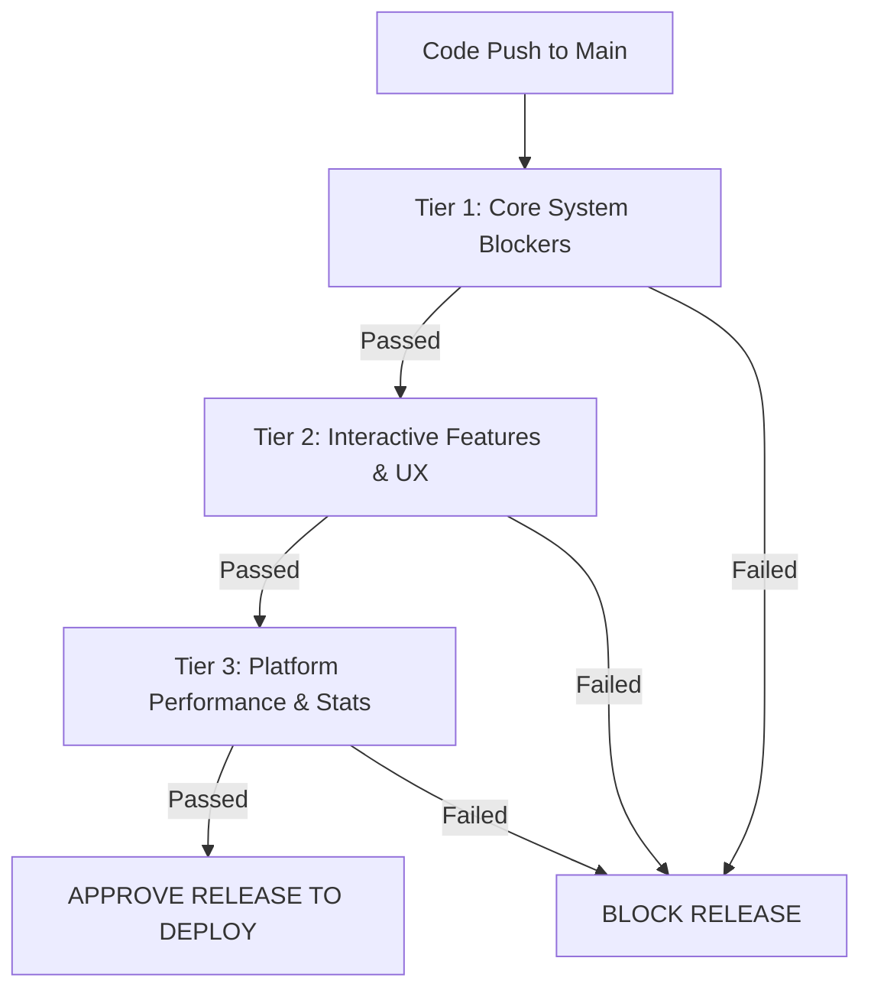

# PixelMark Release Regression Suite & Release Gate Rules

This document outlines the standard release regression suite for PixelMark. New releases are strictly gated and cannot ship to production unless all critical regression flows defined here are green.

---

## 1. High-Impact Regression Coverage Matrix

| Component Area | High-Risk Breakage Vector | Regression Scenario | Verification Strategy |
| :--- | :--- | :--- | :--- |
| **Share Links** | Invalid token auth routing, expired link locks. | Attempt public access using invalid, expired, and deactivated tokens. | Automated backend tests (`test_share_links_backend.py`) and Playwright E2E validations. |
| **Marker Creation** | Coordinates translation offsets on canvas resize. | Resize viewport multiple times, drop pins, and verify coordinates map precisely to targeted DOM selectors. | Playwright resize validations and canvas click tests. |
| **Public Review Access** | Reviewer redirected to `/login` dashboard route. | Access incognito review session. Verify form annotations submit without authenticating. | Playwright incognito session verification. |
| **Multi-Page Proxy** | Navigation escapes base domain to unauthorized URLs. | Click relative and absolute links in proxied page. Verify rewriter intercepts and targets within sandbox bounds. | Multi-page sandbox tests (`test_multi_page_navigation_e2e.py`). |
| **WebGL & Canvas** | Heavy animation loops exhaust client threads or crash. | Load `https://webrox.xyz` Toro WebGL scene. Confirm "WebGL Mode" badge triggers, and CommandCenter UI remains responsive. | Automated Playwright WebGL tests (`test_playwright_webgl.py`). |
| **Asset Resolution** | Blocked tracking scripts block essential CDN chunks. | Attempt loading scripts with tracker analytics keywords. Assert analytics are blocked but bootstrap JS chunks pass. | SSRF and asset safety tests (`test_proxy_hardening.py`). |
| **Mobile Shell** | Sidebar overflows and blocks pin selection tools. | Resize screen width to `375px`. Verify CommandCenter collapses to a bottom drawer and focus rings remain visible. | Responsive breakpoint validations (`test_responsive_shell.py`). |
| **Partial Render** | Missing CSS chunk breaks proxy page visual layout. | Force mock network chunk failure. Verify partial render warning banner mounts with "Retry" action active. | Warning component assertions (`test_responsive_recovery.py`). |
| **Project Delete** | Leftover markers or database orphan records remain. | Delete project with multiple active markers and sessions. Assert cascade deletes succeed across DB tables. | Data chain isolation tests (`test_03_data_chain.py`). |

---

## 2. Priority Test Execution Plan (Regression Suite)

The regression suite is prioritized into three execution tiers (Tier 1: Blocker, Tier 2: Major, Tier 3: Minor). 

### 🔴 Tier 1: Core System Blockers (Must Pass)
1. **User Auth Integration** (`tests/test_02_auth_production.py`)
   - Verifies users can register, authenticate, and maintain secure project access.
2. **SSRF Guard & Safety Bounds** (`tests/test_ssrf_guard.py`)
   - Verifies loopback and private IP networks are blocked inside the HTML rewriter.
3. **Cascade Data Integrity** (`tests/test_03_data_chain.py`)
   - Verifies projects can be deleted cleanly without throwing SQLAlchemy orphan constraint violations.

### 🟡 Tier 2: Interactive Features & UX (Must Pass)
1. **WebGL Badge & Mode Switcher** (`tests/test_playwright_webgl.py`)
   - Verifies heavy modes collapse CommandCenter by default and display cyan WebGL badge.
2. **Multi-Page Navigation Sandbox** (`tests/test_multi_page_navigation_e2e.py`)
   - Verifies target-origin links get rewritten securely, logging fresh `PageVisit` database rows.
3. **Partial Failure Warning Banner** (`tests/test_responsive_recovery.py`)
   - Verifies non-critical asset blocks do not crash the session context, maintaining active marker placement.

### 🟢 Tier 3: Platform Performance & Stats (Verify but non-blocking)
1. **Load Testing & Asset Cache** (`tests/test_09_load.py`)
   - Verifies standard static files load within `< 100ms` when served from the server-side memory cache.
2. **WebSocket Real-time Broadcast** (`tests/test_06_websocket.py`)
   - Verifies markers placed by reviewer propagate instant updates to the owner dashboard.

---

## 3. Official Release Gate Approval Protocol

Before promoting a release candidate from staging to the production branch, the QA lead and deployment manager must verify the following gate rules are green:

> [!IMPORTANT]
> **Gated Rule 1: Zero Red Tests**
> Absolutely no tests in Tier 1 or Tier 2 can be skipped or marked as failing.
>
> **Gated Rule 2: Complete Coverage Check**
> If new features modify the `utils/proxy_rewriter.py` or the `routes/proxy.py`, a dedicated E2E automated test case must be added to the regression suite.
>
> **Gated Rule 3: Visual Checkpoint Approval**
> Playwright screenshot checks (`heavy_03_rendering_check.png` and `heavy_04_mobile_viewport.png`) must show clean layouts without overlay offsets.

### Release Approval Sign-Off Signatures:
- **Lead QA Engineer**: `______________________` Date: `__________`
- **Release Manager**: `______________________` Date: `__________`
